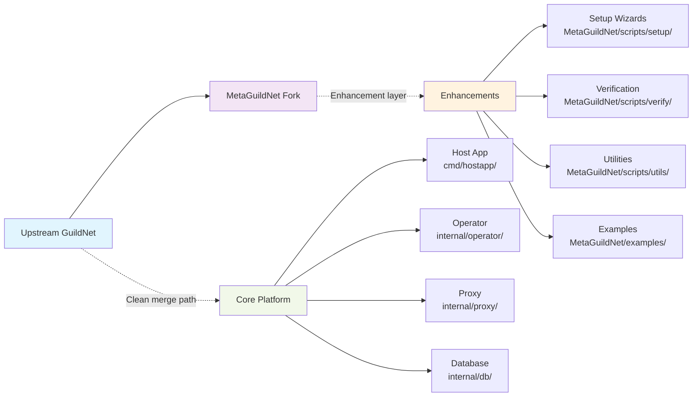
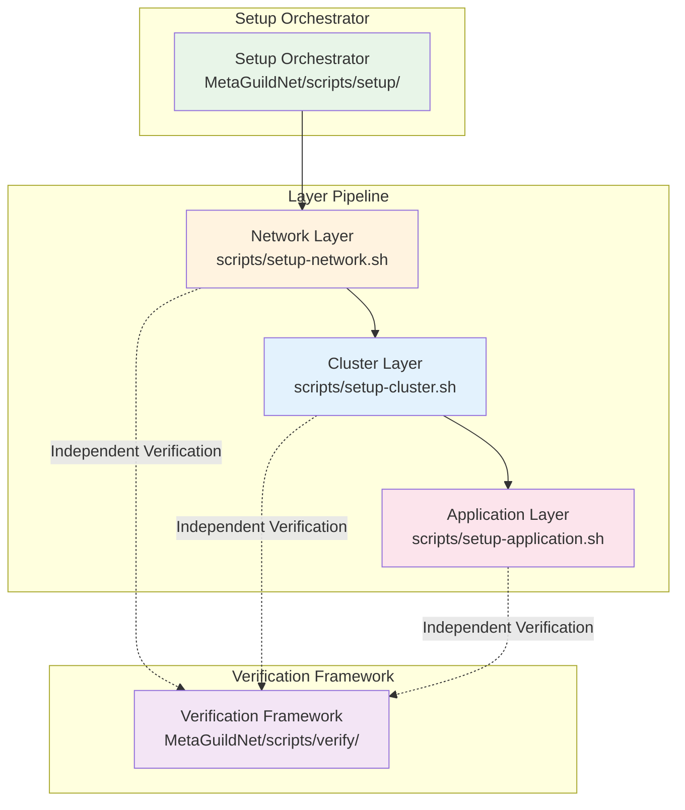
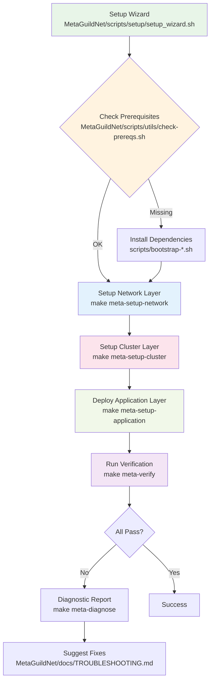
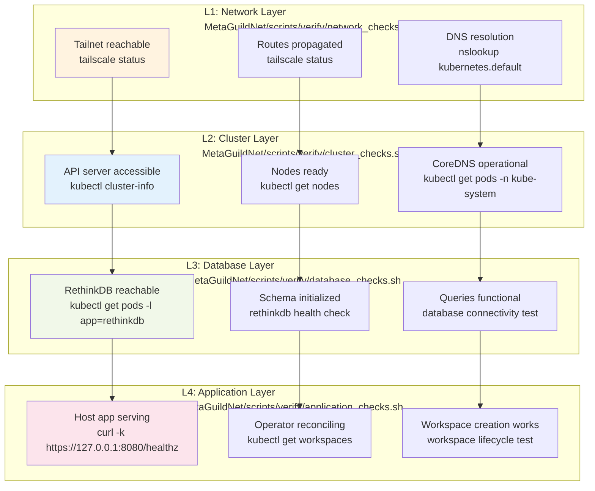
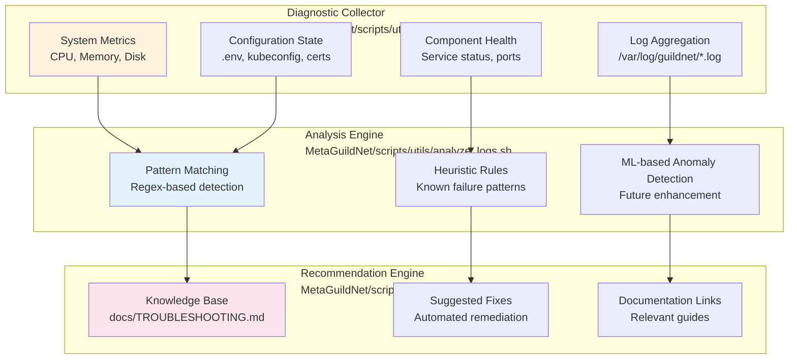
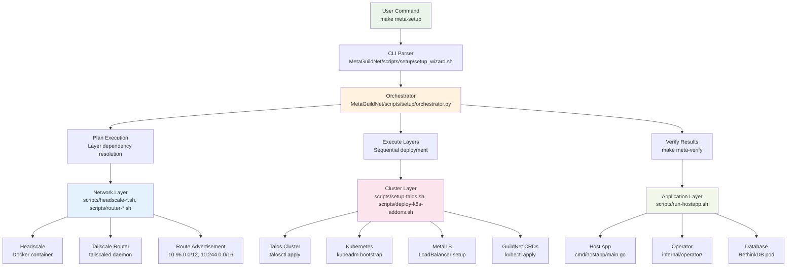
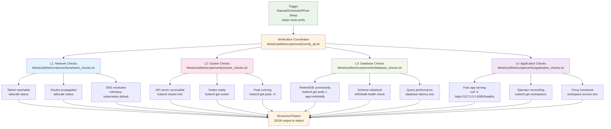

# MetaGuildNet Architecture

**Fork-Specific Design Decisions and Enhancements**

## Overview

MetaGuildNet extends GuildNet with enhanced automation, verification, and developer experience improvements while maintaining full compatibility with the upstream architecture described in [../architecture.md](../../architecture.md).

## Design Principles

### 1. Separation of Concerns



**Benefits:**
- Clean merge path with upstream GuildNet (see [UPSTREAM_SYNC.md](UPSTREAM_SYNC.md))
- Easy to disable/enable fork features
- Clear ownership boundaries
- Maintains compatibility with [architecture.md](../../architecture.md)

### 2. Zero-Config Defaults

Every component has sensible defaults:

```bash
# Works immediately
make meta-setup

# Customizable when needed
PROVIDER=vm METAGN_AUTO_APPROVE_ROUTES=false make meta-setup
```

### 3. Composable Architecture



Each layer is independently verifiable and replaceable. See [VERIFICATION.md](VERIFICATION.md) for detailed verification procedures.

## Enhancements Over Base GuildNet

### 1. Setup Orchestration

**Problem**: GuildNet requires manual step-by-step setup with multiple commands.

**Solution**: Unified setup wizard with automatic dependency resolution.



See [SETUP.md](SETUP.md) for complete setup procedures and [VERIFICATION.md](VERIFICATION.md) for verification details.

**Features:**
- Automatic prerequisite checking
- Idempotent operations (safe to re-run)
- Rollback on critical failures
- Progress indicators with ETAs

### 2. Verification Framework

**Problem**: Manual health checks are error-prone and time-consuming.

**Solution**: Multi-layer automated verification with structured reporting.



See [VERIFICATION.md](VERIFICATION.md) for detailed verification procedures and [CONTRIBUTING.md](CONTRIBUTING.md) for testing guidelines.

**Output Format:**
```json
{
  "timestamp": "2025-10-13T12:34:56Z",
  "overall_status": "healthy",
  "layers": [
    {
      "name": "network",
      "status": "healthy",
      "checks": [
        {"name": "tailnet_reachable", "passed": true, "duration_ms": 45},
        {"name": "routes_propagated", "passed": true, "duration_ms": 120}
      ]
    }
  ]
}
```

### 3. Intelligent Diagnostics

**Problem**: Debugging issues requires deep knowledge of the stack.

**Solution**: Structured diagnostic tools with actionable suggestions.

```bash
$ make meta-diagnose

[NETWORK]
✗ Tailnet unreachable
  → Suggestion: Check if tailscaled is running
  → Command: sudo systemctl status tailscaled
  → Docs: MetaGuildNet/docs/TROUBLESHOOTING.md#tailnet-unreachable

[CLUSTER]
✓ Kubernetes API healthy
✓ All nodes ready

[DATABASE]
⚠ RethinkDB slow response (350ms)
  → Suggestion: Check system resources
  → Command: kubectl top pods -n default -l app=rethinkdb
  → Threshold: 200ms expected

[APPLICATION]
✓ Host app healthy
✓ Operator reconciling
```

### 4. Testing Infrastructure

**Structure:**

```
tests/
├── integration/                 # Component integration
│   ├── network_cluster_test.sh  # Network → Cluster
│   ├── cluster_db_test.sh       # Cluster → Database
│   └── app_proxy_test.sh        # App → Proxy
└── e2e/                         # End-to-end scenarios
    ├── workspace_lifecycle.sh   # Full workspace flow
    ├── multi_workspace.sh       # Multiple workspaces
    └── failover.sh              # Resilience testing
```

**Test Framework:**

```bash
#!/bin/bash
# tests/integration/example_test.sh

source "$(dirname "$0")/../lib/test_framework.sh"

test_suite "Example Integration Test"

test_case "component X can talk to component Y" {
  setup() {
    # Arrange
    export TEST_VAR="value"
  }
  
  run() {
    # Act
    result=$(call_component_x)
  }
  
  assert() {
    # Assert
    assert_equals "$result" "expected_value"
  }
  
  teardown() {
    # Cleanup
    unset TEST_VAR
  }
}

run_test_suite
```

### 5. Developer Experience Improvements

#### Smart Environment Management

**Problem**: Managing multiple environment variables is tedious.

**Solution**: Layered configuration with smart defaults.

```bash
# Priority (high to low):
1. CLI arguments      (--flag=value)
2. .env.local         (git-ignored, developer overrides)
3. .env               (project defaults)
4. MetaGuildNet defaults (embedded in scripts)
5. GuildNet defaults  (upstream)
```

#### Convenience Wrappers

```bash
# Instead of:
export KUBECONFIG=~/.guildnet/kubeconfig
kubectl --context=guildnet get nodes
kubectl --namespace=default get pods

# Use:
metagn kubectl get nodes
metagn kubectl get pods  # Auto-detects namespace
```

#### Interactive Mode

```bash
$ make meta-setup METAGN_SETUP_MODE=interactive

╔════════════════════════════════════════╗
║   MetaGuildNet Setup Wizard            ║
╚════════════════════════════════════════╝

Choose setup profile:
  1) Development (single-node, minimal resources)
  2) Production (multi-node, HA, persistent storage)
  3) Custom (configure each layer)

Selection [1]: _
```

## Technical Implementation Details

### Setup Orchestrator

**Core Algorithm:**

```python
def orchestrate_setup(config):
    """
    Orchestrates multi-layer setup with dependency resolution.
    """
    layers = [
        NetworkLayer(config),
        ClusterLayer(config),
        ApplicationLayer(config)
    ]
    
    for layer in layers:
        # Check prerequisites
        if not layer.check_prerequisites():
            layer.install_prerequisites()
        
        # Setup with retries
        success = retry(
            layer.setup,
            max_attempts=3,
            backoff=exponential_backoff(base=2, max=30)
        )
        
        if not success:
            rollback(layers[:layers.index(layer)])
            raise SetupError(f"{layer.name} setup failed")
        
        # Verify
        if not layer.verify():
            raise VerificationError(f"{layer.name} verification failed")
    
    return SetupResult(success=True, layers=layers)
```

### Verification Framework

**Implementation:**

```go
// MetaGuildNet/pkg/verify/framework.go

type Verification struct {
    Name        string
    Description string
    Timeout     time.Duration
    Check       func(context.Context) error
}

type VerificationSuite struct {
    Name          string
    Verifications []Verification
    Parallel      bool
}

func (s *VerificationSuite) Run(ctx context.Context) (*Report, error) {
    report := &Report{
        Timestamp: time.Now(),
        Suite:     s.Name,
        Results:   make([]Result, 0, len(s.Verifications)),
    }
    
    if s.Parallel {
        return s.runParallel(ctx, report)
    }
    return s.runSequential(ctx, report)
}
```

### Diagnostic System

**Architecture:**



See [VERIFICATION.md](VERIFICATION.md) for diagnostic procedures and troubleshooting guides.

## Data Flow

### Setup Flow



Each layer reports progress and verification results. See [SETUP.md](SETUP.md) for detailed setup procedures.

### Verification Flow



Results aggregated into structured report. See [VERIFICATION.md](VERIFICATION.md) for detailed verification procedures.

## Extension Points

### Adding New Verification Checks

```bash
# MetaGuildNet/scripts/verify/custom_check.sh

# Source the framework
source "$(dirname "$0")/../../lib/verify_framework.sh"

# Define your check
verify_custom_component() {
    local name="custom_component"
    local description="Verify custom component is healthy"
    
    verify_start "$name" "$description"
    
    # Your verification logic
    if custom_health_check; then
        verify_pass "$name"
    else
        verify_fail "$name" "Component unhealthy"
    fi
}

# Register with the framework
register_verification "L5" "verify_custom_component"
```

### Adding New Setup Layers

```bash
# MetaGuildNet/scripts/setup/custom_layer.sh

setup_custom_layer() {
    log_info "Setting up custom layer..."
    
    # Prerequisites
    require_command "custom_cli" "Install from https://custom.io"
    
    # Setup logic
    if ! custom_cli setup; then
        log_error "Custom layer setup failed"
        return 1
    fi
    
    # Verification
    if ! verify_custom_layer; then
        log_error "Custom layer verification failed"
        return 1
    fi
    
    log_success "Custom layer ready"
}
```

## Performance Considerations

### Setup Performance

**Targets:**
- Full setup: < 10 minutes (single node)
- Verification: < 30 seconds (all layers)
- Diagnostics: < 5 seconds (initial scan)

**Optimizations:**
- Parallel operations where safe
- Caching of downloads/builds
- Incremental verification
- Connection pooling

### Resource Requirements

**Minimum:**
- CPU: 4 cores
- RAM: 8 GB
- Disk: 50 GB
- Network: 10 Mbps

**Recommended:**
- CPU: 8 cores
- RAM: 16 GB
- Disk: 100 GB SSD
- Network: 100 Mbps

## Security Considerations

### Secrets Management

```bash
# Sensitive values never logged
SENSITIVE_VARS=(
    "TS_AUTHKEY"
    "GITHUB_TOKEN"
    "DB_PASSWORD"
)

log_config() {
    for var in "${!ENV_VARS[@]}"; do
        if [[ " ${SENSITIVE_VARS[@]} " =~ " ${var} " ]]; then
            echo "$var=***REDACTED***"
        else
            echo "$var=${ENV_VARS[$var]}"
        fi
    done
}
```

### Network Security

- All external communication over TLS
- Tailnet for inter-component traffic
- No services exposed to public internet by default
- Kubernetes NetworkPolicies for pod isolation

### Access Control

- RBAC for Kubernetes resources
- Tailscale ACLs for network access
- No default passwords (generated unique per install)

## Future Enhancements

### Planned Features

1. **ML-Based Diagnostics**: Pattern recognition for common failure modes
2. **Automated Remediation**: Self-healing capabilities
3. **Multi-Cluster Management**: Federated GuildNet clusters
4. **Observability Stack**: Prometheus + Grafana + Loki
5. **Backup/Restore**: Automated backup of state and data
6. **CI/CD Integration**: GitHub Actions workflows

### Research Areas

- **Distributed Tracing**: OpenTelemetry integration
- **Cost Optimization**: Resource usage analytics
- **Auto-Scaling**: Dynamic workspace scaling
- **GitOps**: ArgoCD/Flux integration

## References

### GuildNet Repository
- [Core Architecture](../../architecture.md) - Upstream GuildNet architecture
- [Host Application](../../cmd/hostapp/main.go) - Main application entry point
- [Operator Implementation](../../internal/operator/) - Kubernetes operator logic
- [Proxy Implementation](../../internal/proxy/) - WebSocket proxy functionality
- [Database Layer](../../internal/db/) - Database integration
- [API Router](../../internal/api/router.go) - HTTP API routing

### External Documentation
- [Kubernetes Documentation](https://kubernetes.io/docs/) - Container orchestration
- [Tailscale Architecture](https://tailscale.com/kb/1017/install/) - Zero-trust networking
- [Talos Linux](https://www.talos.dev/) - Kubernetes-focused Linux distribution
- [RethinkDB Documentation](https://rethinkdb.com/docs/) - Distributed database

### MetaGuildNet Extensions
- [Setup Guide](SETUP.md) - Complete installation procedures
- [Verification Guide](VERIFICATION.md) - Health checks and diagnostics
- [Contributing Guide](CONTRIBUTING.md) - Development workflows
- [Upstream Sync](UPSTREAM_SYNC.md) - Synchronization procedures

---

**Maintenance**: This document is updated with each major architectural change. Last updated: 2025-10-13

