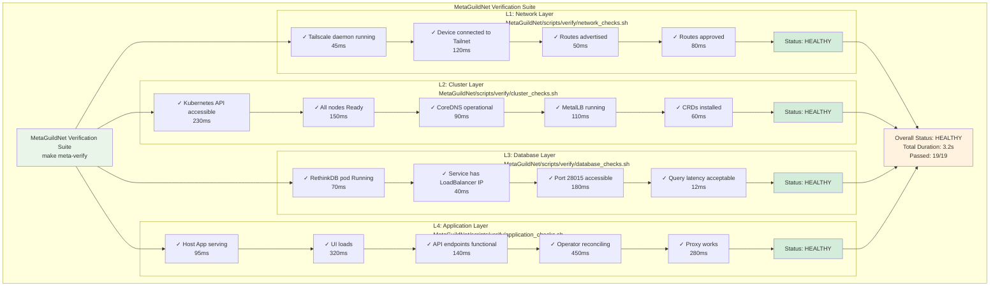

# MetaGuildNet Verification Guide

**Comprehensive testing and health check procedures**

## Overview

Verification ensures all components of the GuildNet stack are functioning correctly. This guide covers automated verification, manual checks, and troubleshooting procedures.

## Verification Levels

### L1: Network Layer

Verifies Tailscale network connectivity and route propagation.

**Automated Check:**
```bash
make meta-verify-network
```

**Manual Checks:**

```bash
# 1. Verify Tailscale is running
tailscale status

# Expected output:
# Health check:
#   - idle
# Tailscale IP: 100.64.0.1
# Logged in as: guildnet-user

# 2. Verify routes are advertised and approved
tailscale status | grep -A 5 "Advertised routes"

# Expected output:
# Advertised routes:
#   10.96.0.0/12 (approved)
#   10.244.0.0/16 (approved)

# 3. Test Tailnet connectivity from another device
ping <tailscale-ip>
curl -k https://<tailscale-ip>:443/healthz
```

**Health Criteria:**
- ✓ Tailscale daemon running
- ✓ Device connected to Tailnet
- ✓ Required routes advertised
- ✓ Routes approved in Headscale
- ✓ Reachable from other Tailnet devices

**Common Issues:**

| Symptom | Cause | Solution |
|---------|-------|----------|
| Tailscale not connected | Daemon not running | `make router-daemon-sudo` |
| Routes not approved | Manual approval needed | `make headscale-approve-routes` |
| Unreachable from other devices | Firewall blocking | Allow ports 443, 41641/UDP |

### L2: Cluster Layer

Verifies Kubernetes cluster health and accessibility.

**Automated Check:**
```bash
make meta-verify-cluster
```

**Manual Checks:**

```bash
# 1. Verify Kubernetes API is accessible
export KUBECONFIG=~/.guildnet/kubeconfig
kubectl cluster-info

# Expected output:
# Kubernetes control plane is running at https://192.168.1.101:6443
# CoreDNS is running at https://192.168.1.101:6443/api/v1/namespaces/kube-system/services/kube-dns:dns/proxy

# 2. Verify all nodes are Ready
kubectl get nodes

# Expected output:
# NAME      STATUS   ROLES           AGE   VERSION
# talos-1   Ready    control-plane   10m   v1.30.1
# talos-2   Ready    worker          9m    v1.30.1

# 3. Verify critical pods are running
kubectl get pods -A | grep -E "kube-system|metallb"

# Expected output:
# kube-system     coredns-xxx                  1/1     Running
# kube-system     kube-apiserver-talos-1       1/1     Running
# metallb-system  controller-xxx               1/1     Running
# metallb-system  speaker-xxx                  1/1     Running

# 4. Verify MetalLB has address pool
kubectl get ipaddresspool -n metallb-system

# Expected output:
# NAME             AUTO ASSIGN   AVOID BUGGY IPS   ADDRESSES
# guildnet-pool    true          false             192.168.1.200-192.168.1.250

# 5. Verify CRDs are installed
kubectl get crds | grep guildnet.io

# Expected output:
# capabilities.guildnet.io
# workspaces.guildnet.io
```

**Health Criteria:**
- ✓ Kubernetes API responsive (< 2s)
- ✓ All nodes Ready
- ✓ CoreDNS running
- ✓ MetalLB operational
- ✓ GuildNet CRDs present

**Common Issues:**

| Symptom | Cause | Solution |
|---------|-------|----------|
| API unreachable | Wrong kubeconfig | `export KUBECONFIG=~/.guildnet/kubeconfig` |
| Nodes NotReady | Kubelet issues | `talosctl -n <node> service kubelet status` |
| Pods Pending | No resources | `kubectl describe pod <pod>` |
| MetalLB not working | Wrong address pool | Check `config/metallb/ipaddresspool.yaml` |

### L3: Database Layer

Verifies RethinkDB connectivity and schema.

**Automated Check:**
```bash
make meta-verify-database
```

**Manual Checks:**

```bash
# 1. Verify RethinkDB pod is running
kubectl get pods -l app=rethinkdb

# Expected output:
# NAME           READY   STATUS    RESTARTS   AGE
# rethinkdb-0    1/1     Running   0          5m

# 2. Verify RethinkDB service exists
kubectl get svc rethinkdb

# Expected output:
# NAME        TYPE           CLUSTER-IP      EXTERNAL-IP      PORT(S)
# rethinkdb   LoadBalancer   10.96.123.45    192.168.1.200    28015:30123/TCP

# 3. Test connectivity from Host App
curl -k https://127.0.0.1:8080/api/health | jq .database

# Expected output:
# {
#   "status": "healthy",
#   "connection": "ok",
#   "latency_ms": 12,
#   "databases": ["guildnet", "test"]
# }

# 4. Test direct connection (if accessible)
# Install rethinkdb client: pip install rethinkdb
python3 << EOF
import rethinkdb as r
conn = r.connect(host='192.168.1.200', port=28015)
dbs = r.db_list().run(conn)
print(f"Databases: {dbs}")
conn.close()
EOF
```

**Health Criteria:**
- ✓ RethinkDB pod Running
- ✓ Service has external IP (LoadBalancer)
- ✓ Port 28015 accessible
- ✓ Query latency < 100ms
- ✓ Required databases exist

**Common Issues:**

| Symptom | Cause | Solution |
|---------|-------|----------|
| Pod CrashLoopBackOff | Resource constraints | Increase memory limits |
| Service Pending | MetalLB not ready | Check MetalLB logs |
| Connection refused | Service not exposed | Verify LoadBalancer IP assigned |
| Slow queries | Resource contention | Check node resources |

### L4: Application Layer

Verifies Host App, Operator, and Workspace lifecycle.

**Automated Check:**
```bash
make meta-verify-application
```

**Manual Checks:**

```bash
# 1. Verify Host App is serving
curl -k https://127.0.0.1:8080/healthz

# Expected output:
# {"status":"ok"}

# 2. Verify UI is accessible
curl -k https://127.0.0.1:8080/ | grep -q "GuildNet"

# 3. Verify API endpoints
curl -sk https://127.0.0.1:8080/api/ui-config | jq .

# Expected output:
# {
#   "version": "0.1.0",
#   "features": ["workspaces", "database", "proxy"]
# }

# 4. Verify operator is reconciling
kubectl get workspaces

# Create test workspace
cat << EOF | kubectl apply -f -
apiVersion: guildnet.io/v1alpha1
kind: Workspace
metadata:
  name: test-verify
spec:
  image: codercom/code-server:latest
EOF

# Wait for reconciliation
kubectl wait --for=condition=Ready workspace/test-verify --timeout=120s

# Verify deployment created
kubectl get deployment test-verify

# Verify service created
kubectl get svc test-verify

# Cleanup
kubectl delete workspace test-verify

# 5. Verify proxy works
# Create workspace via API
curl -sk -X POST https://127.0.0.1:8080/api/jobs \
  -H "Content-Type: application/json" \
  -d '{"image":"codercom/code-server:latest","name":"verify-proxy"}'

# Wait for running state
sleep 30

# Get workspace ID
WORKSPACE_ID=$(curl -sk https://127.0.0.1:8080/api/servers | jq -r '.[0].id')

# Test proxy
curl -sk https://127.0.0.1:8080/proxy/server/$WORKSPACE_ID/ | grep -q "code-server"

# Cleanup
curl -sk -X DELETE https://127.0.0.1:8080/api/servers/$WORKSPACE_ID
```

**Health Criteria:**
- ✓ Host App responding (< 1s)
- ✓ UI loads successfully
- ✓ API endpoints functional
- ✓ Operator creating resources
- ✓ Workspaces reach Ready state
- ✓ Proxy correctly routes traffic
- ✓ WebSocket upgrades work

**Common Issues:**

| Symptom | Cause | Solution |
|---------|-------|----------|
| 502 Bad Gateway | Host App crashed | Check logs, restart |
| Operator not reconciling | RBAC issues | Verify ServiceAccount permissions |
| Workspace stuck Pending | Image pull failure | Check imagePullSecret |
| Proxy 504 timeout | Backend not ready | Check pod readiness probe |

## Automated Verification Suite

### Run All Verifications

```bash
# Full verification (all layers)
make meta-verify

**Output Format:**



See [ARCHITECTURE.md](ARCHITECTURE.md) for the verification framework architecture.
```

### Run Specific Layer

```bash
# Individual layers
make meta-verify-network
make meta-verify-cluster
make meta-verify-database
make meta-verify-application

# JSON output for automation
make meta-verify-json > verification-report.json

# Example JSON:
{
  "timestamp": "2025-10-13T12:34:56Z",
  "overall_status": "healthy",
  "duration_ms": 3200,
  "layers": [
    {
      "name": "network",
      "status": "healthy",
      "checks": [
        {"name": "tailscale_running", "passed": true, "duration_ms": 45},
        {"name": "device_connected", "passed": true, "duration_ms": 120}
      ]
    }
  ]
}
```

### Continuous Verification

```bash
# Watch mode (re-run every 30s)
make meta-verify-watch

# Scheduled cron job (every 5 minutes)
*/5 * * * * cd /path/to/GuildNet && make meta-verify-json >> /var/log/guildnet-health.log 2>&1
```

## Integration Tests

Test interactions between components:

```bash
# Run all integration tests
make -C MetaGuildNet test-integration

# Run specific integration test
bash MetaGuildNet/tests/integration/network_cluster_test.sh
bash MetaGuildNet/tests/integration/cluster_db_test.sh
bash MetaGuildNet/tests/integration/app_proxy_test.sh
```

### Example Integration Test

```bash
# Network → Cluster connectivity
bash MetaGuildNet/tests/integration/network_cluster_test.sh

# Test flow:
# 1. Verify routes are advertised
# 2. Attempt to reach Kubernetes API via Tailnet
# 3. Verify DNS resolution works
# 4. Test pod-to-pod communication

# Output:
# [TEST] Network → Cluster Integration
#   ✓ Routes include cluster CIDRs
#   ✓ Can reach Kubernetes API via Tailnet (234ms)
#   ✓ DNS resolves cluster services (45ms)
#   ✓ Pods can communicate (67ms)
# Result: PASS (4/4 checks)
```

## End-to-End Tests

Test complete workflows:

```bash
# Run all E2E tests
make -C MetaGuildNet test-e2e

# Run specific E2E test
bash MetaGuildNet/tests/e2e/workspace_lifecycle.sh
bash MetaGuildNet/tests/e2e/multi_workspace.sh
```

### Example E2E Test

```bash
# Full workspace lifecycle
bash MetaGuildNet/tests/e2e/workspace_lifecycle.sh

# Test flow:
# 1. Create workspace via API
# 2. Wait for Running state
# 3. Access via proxy
# 4. Execute command in workspace
# 5. Delete workspace
# 6. Verify cleanup

# Output:
# [E2E] Workspace Lifecycle
#   ✓ Created workspace 'test-e2e-xxx' (2.3s)
#   ✓ Workspace reached Running state (45s)
#   ✓ Proxy returns 200 OK (1.2s)
#   ✓ Command execution successful (0.8s)
#   ✓ Workspace deleted (3.1s)
#   ✓ Resources cleaned up (2.4s)
# Result: PASS (6/6 steps)
# Duration: 55.8s
```

## Performance Benchmarks

Verify performance meets targets:

```bash
# Run performance benchmarks
make -C MetaGuildNet benchmark

# Benchmarks:
# - Workspace creation time
# - Proxy latency
# - Database query performance
# - API response times

# Output:
# [BENCHMARK] Workspace Creation
#   Min: 23.4s
#   Max: 47.2s
#   Avg: 31.8s
#   Target: < 45s
#   Status: PASS
# 
# [BENCHMARK] Proxy Latency
#   P50: 45ms
#   P95: 120ms
#   P99: 230ms
#   Target: P95 < 200ms
#   Status: PASS
```

## Load Testing

Test system under load:

```bash
# Create multiple workspaces concurrently
make -C MetaGuildNet load-test CONCURRENT=10

# This creates 10 workspaces in parallel and measures:
# - Success rate
# - Average creation time
# - Resource utilization
# - Error rate

# Output:
# [LOAD TEST] 10 Concurrent Workspaces
#   Success: 10/10 (100%)
#   Avg Creation Time: 38.2s
#   Max Creation Time: 52.1s
#   CPU Usage: 68%
#   Memory Usage: 7.2 GB / 16 GB
#   Status: PASS
```

## Diagnostics and Troubleshooting

### Generate Diagnostic Report

```bash
# Full diagnostic scan
make meta-diagnose

# Output shows issues and suggestions:
# [NETWORK]
# ✓ Tailnet healthy
# 
# [CLUSTER]
# ✓ Kubernetes API healthy
# ⚠ Node talos-2 high memory usage (89%)
#   → Suggestion: Consider adding memory or removing workloads
#   → Command: kubectl top node talos-2
# 
# [DATABASE]
# ✓ RethinkDB healthy
# 
# [APPLICATION]
# ✗ Workspace 'prod-workspace' stuck in Pending
#   → Suggestion: Check image pull status
#   → Command: kubectl describe pod -l workspace=prod-workspace
#   → Docs: MetaGuildNet/docs/TROUBLESHOOTING.md#workspace-pending
```

### Export Diagnostic Bundle

```bash
# Create diagnostic bundle for support
make meta-export-diagnostics

# Output: MetaGuildNet/diagnostics-20251013-123456.tar.gz
# Contains:
# - All logs (Host App, Operator, Pods)
# - Configuration files
# - System information
# - Network traces
# - Resource usage
# - Recent events

# Upload to support:
# curl -F "file=@MetaGuildNet/diagnostics-*.tar.gz" https://support.company.com/upload
```

### Step-by-Step Verification

```bash
# Run verification with detailed output
make meta-verify-verbose

# Or step-by-step with pauses
make meta-verify-step-by-step

# Each layer waits for confirmation:
# [L1: Network Layer]
#   Running checks...
#   ✓ All checks passed
# 
# Press Enter to continue to L2 (Cluster Layer)...
```

## Monitoring and Alerting

### Prometheus Metrics (Future)

```yaml
# Example Prometheus scrape config
scrape_configs:
  - job_name: 'guildnet-hostapp'
    static_configs:
      - targets: ['127.0.0.1:9090']
    metrics_path: '/metrics'
```

**Key Metrics:**
- `guildnet_workspaces_total`: Total workspaces
- `guildnet_workspaces_running`: Running workspaces
- `guildnet_proxy_requests_total`: Proxy request count
- `guildnet_proxy_latency_seconds`: Proxy latency histogram
- `guildnet_operator_reconcile_duration_seconds`: Operator reconciliation time

### Health Check Endpoints

```bash
# Application health
curl -sk https://127.0.0.1:8080/healthz

# Detailed health
curl -sk https://127.0.0.1:8080/api/health | jq .

# Metrics (if enabled)
curl -sk https://127.0.0.1:8080/metrics
```

## Best Practices

### Regular Verification

```bash
# Run after any changes
make meta-verify

# Run before important operations
make meta-verify && make deploy-production

# Add to CI/CD
# .github/workflows/test.yml
- name: Verify Stack
  run: make meta-verify
```

### Test Before Production

```bash
# 1. Run in test environment
make meta-setup
make meta-verify
make test-e2e

# 2. If all pass, promote to production
make deploy-production

# 3. Verify production
make meta-verify
```

### Automated Monitoring

```bash
# Setup health check monitoring
crontab -e

# Add:
*/5 * * * * cd /path/to/GuildNet && make meta-verify-json >> /var/log/guildnet-health.log 2>&1

# Alert on failures
*/5 * * * * cd /path/to/GuildNet && make meta-verify || echo "ALERT: GuildNet health check failed" | mail -s "GuildNet Alert" admin@company.com
```

## Verification Checklist

Use this checklist for manual verification:

```markdown
### Network Layer
- [ ] Tailscale daemon running
- [ ] Device connected to Tailnet
- [ ] Routes advertised
- [ ] Routes approved
- [ ] Reachable from other devices

### Cluster Layer
- [ ] Kubernetes API accessible
- [ ] All nodes Ready
- [ ] CoreDNS running
- [ ] MetalLB operational
- [ ] CRDs installed

### Database Layer
- [ ] RethinkDB pod Running
- [ ] Service has LoadBalancer IP
- [ ] Port 28015 accessible
- [ ] Query latency acceptable
- [ ] Required databases exist

### Application Layer
- [ ] Host App serving
- [ ] UI loads successfully
- [ ] API endpoints functional
- [ ] Operator reconciling
- [ ] Workspaces can be created
- [ ] Proxy works correctly
- [ ] Logs are accessible

### Integration
- [ ] Can create workspace via UI
- [ ] Can access workspace via proxy
- [ ] Can execute commands in workspace
- [ ] Can delete workspace
- [ ] Resources cleaned up
```

---

## References

### GuildNet Repository
- [Core Architecture](../../architecture.md) - Upstream system design
- [Host App Implementation](../../cmd/hostapp/main.go) - Main application entry point
- [Operator Code](../../internal/operator/) - Kubernetes operator logic
- [Database Integration](../../internal/db/) - Database connectivity
- [API Implementation](../../internal/api/router.go) - HTTP API routing
- [Makefile](../../Makefile) - Build targets and automation commands

### MetaGuildNet Extensions
- [Architecture Guide](ARCHITECTURE.md) - Fork-specific design decisions
- [Setup Guide](SETUP.md) - Installation and configuration procedures
- [Contributing Guide](CONTRIBUTING.md) - Development and testing workflows
- [Upstream Sync](UPSTREAM_SYNC.md) - Synchronization with upstream GuildNet

### External Resources
- [Kubernetes Documentation](https://kubernetes.io/docs/) - Container orchestration
- [kubectl Cheat Sheet](https://kubernetes.io/docs/reference/kubectl/quick-reference/) - kubectl command reference
- [Tailscale Documentation](https://tailscale.com/kb/) - Zero-trust networking
- [RethinkDB Documentation](https://rethinkdb.com/docs/) - Distributed database
- [Talos Linux](https://www.talos.dev/) - Kubernetes-focused OS

**Remember**: Verification is not optional. Always verify after setup, changes, or before important operations.

