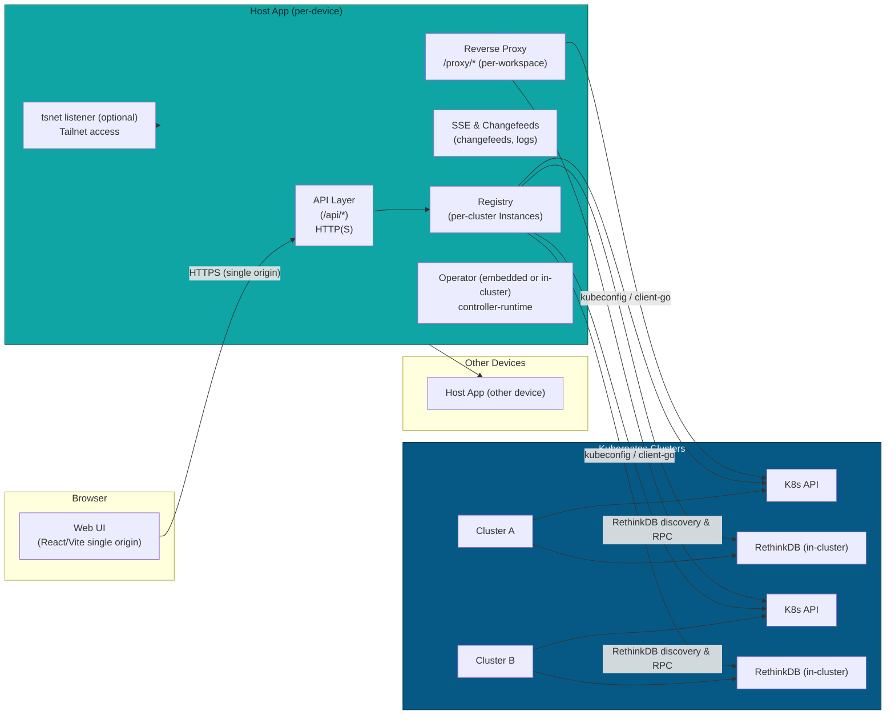
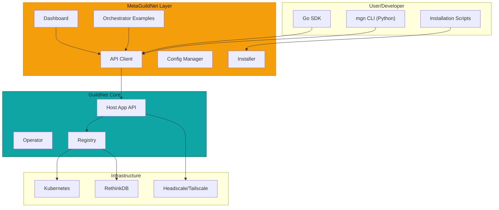

GuildNet Architecture (complete, code-driven)

This file now reflects the current codebase behavior and the features implemented across the Host App, embedded operator, proxying, and database management. The Host App is intended to run on every device in a fleet; each instance acts as a local portal and can join and manage multiple Kubernetes clusters by persisting per-cluster kubeconfigs and running per-cluster clients.

### Component Overview (distributed)



High level summary

- Per-cluster kubeconfigs: the Host App stores kubeconfigs in local state and looks them up under the DB key `credentials:cl:{id}:kubeconfig` when creating per-cluster `Instance` clients. For interactive dev flows the code now prefers `~/.guildnet/kubeconfig` as the default kubeconfig before `~/.kube/config`.
- `POST /bootstrap` accepts a join payload (`guildnet.config` file or JSON with `cluster.kubeconfig`), persists a cluster record and kubeconfig, then performs a bounded pre-warm (10s) which attempts a light Kubernetes API call and a short `EnsureRDB`. On pre-warm failure bootstrap rolls back persisted state and returns an error.
- The Registry builds and caches `Instance` objects. Each `Instance` encapsulates:
  - per-cluster SQLite (`internal/localdb`)
  - `k8s.Client` and rest.Config (`internal/k8s`)
  - a dynamic client for CRD operations (`Instance.Dyn`)
  - a port-forward manager (de-duplicated per Instance)
  - a lazily-initialized RethinkDB manager via `Instance.EnsureRDB` (used by DB APIs and pre-warm)

### Dynamic Workspaces & code-server behavior

- The Host App exposes HTTP APIs and UI-first flows to create Workspaces; user requests are translated into `Workspace` CRs in the target cluster via the per-cluster client.
- The Workspace reconciler (`internal/operator/workspace_controller.go`) ensures Deployments and Services for each Workspace. Important behaviors:
  - Default container port is 8080 when `spec.ports` is omitted.
  - The controller ensures `PORT=8080` and sets a `PASSWORD` env for code-server images when none is provided (defaults to `changeme` in dev flows).
  - For code-server images (detected by image name substrings) the reconciler injects args so the server binds to `0.0.0.0:8080` and uses `--auth password`.
  - The reconciler supports unprivileged image patterns (nginx/cache) by applying an initContainer that chowns cache paths and mounting an `emptyDir` where appropriate, plus setting PodSecurityContext (fsGroup/runAsUser) so containers can write caches without requiring privileged images.
  - Services are created with `publishNotReadyAddresses=true` so the Host App proxy may route while pods are warming; the controller can set `Service.type=LoadBalancer` when requested via `Workspace.Spec.Exposure`.

This allows the system to spin up code-server and similar IDE images and make them accessible via the Host App reverse proxy.

### Reverse proxying and websockets

- Transport selection: the reverse proxy (`internal/proxy/reverse_proxy.go`) supports multiple resolution/transport modes in this priority:
  1. Dial the Service IP (ClusterIP) or LoadBalancer IP.
  2. Dial a host:port hint (if `AGENT_HOST` or similar hint is present).
  3. Use an API-proxy transport (for API-like paths) when a local `kubectl proxy` or API-proxy transport is available.
  4. Fallback to a managed SPDY port-forward (routes to `127.0.0.1:<pf>`) when direct connections are not available.
- The proxy composes two http.Transports and a `dualTransport` that uses the API-proxy transport for API paths and the standard transport for normal traffic.
- WebSocket upgrades are supported and tested via `tests/ws_proxy_test.go`.
- Header rewriting: the proxy rewrites `Location` and `Set-Cookie` attributes (drops Domain, sets Secure, SameSite=None, normalizes Path) and sets `X-Forwarded-Prefix` so embedded UIs served from a subpath behave correctly within an iframe.

Dev convenience: the router can detect a local `kubectl proxy` and rewrite cluster REST Hosts to `http://127.0.0.1:8001` when available; this provides a fast local transport in dev runs and avoids certificate or network mismatches.

### Database (RethinkDB) operations and UI features

- Discovery logic (`internal/db/cluster.go`) attempts to find a reachable RethinkDB endpoint using:
  1. Explicit address override (if provided)
  2. LoadBalancer Ingress (Service)
  3. NodePort (resolving node IPs)
  4. ClusterIP
- Connections use rethinkdb-go with short timeouts and small pools. `Instance.EnsureRDB` establishes the connection; handlers use `Registry.RDBPresent(clusterID)` to avoid triggering long reconnect attempts.
- The Host App implements a DB management API used by the UI, including create/drop DBs, list/create/drop tables, row CRUD endpoints, import/export, permission and audit endpoints, and streaming SSE changefeeds.

### Join/bootstrap flow and cluster management

- `scripts/generate_join_config.sh` produces `guildnet.config` join artifacts used by the UI and automation.
- `POST /bootstrap` persists cluster records and kubeconfigs, then pre-warms clients and RDB connectivity. On failure, state is rolled back to keep the UI consistent.

### Operator modes and CRDs

- CRDs for `Workspace` and `Capabilities` live in `config/crd/`.
- Operator modes supported:
  - Embedded (in-process) operator: default dev flow when running `./scripts/run-hostapp.sh` — easy feedback, single binary.
  - In-cluster operator: recommended for production (Deployment in `guildnet-system`).
  - System-installed operator via systemd: supported but can cause collisions with manual runs (systemd unit files are provided in packaging). If you run manually for debugging, mask/disable the systemd unit to avoid duplicate operators and unexpected shutdowns.

- The reconciler uses controller-runtime's `CreateOrUpdate` patterns and updates Workspace Status fields: `ServiceDNS`, `ServiceIP`, `ReadyReplicas`, `Phase`, and `ProxyTarget`.

### API Surface (summary)

- Health & status
  - GET `/healthz` — quick liveness & readiness checks

- Join/bootstrap
  - POST `/bootstrap` — accept join file or JSON with kubeconfig and optional hints (pre-warm clients)

- Jobs / Workspaces
  - POST `/api/jobs` — create a workspace (translates to a Workspace CR)
  - GET `/api/jobs`, GET `/api/jobs/{id}` — list and inspect

- Per-cluster operations
  - GET/PUT `/api/settings/cluster/{id}` — cluster settings
  - GET `/api/cluster/{id}/servers` — list workspaces
  - Proxy: `/api/cluster/{id}/proxy/server/{name}/...` — proxy to workspace servers (sets `X-Forwarded-Prefix`)

- Database API (per cluster)
  - GET/POST `/api/cluster/{id}/db` — list/create DBs
  - /tables and /rows endpoints for table and row operations
  - Import/Export, permissions, audit endpoints
  - SSE changefeeds: `/sse/cluster/{id}/db/{dbId}/tables/{table}/changes`

### Wiring, lifecycle and implementation notes

- `Registry.Get(ctx,id)` creates and caches `Instance` objects. `Registry.RDBPresent` avoids expensive RDB initialization during normal request handling.
- Port-forwards are used only as fallbacks for UI/IDE proxying and are de-duplicated per Instance.
- The dynamic client for CRDs is created once per Instance and reused.

### Observability and metrics

- Structured logs contain request IDs and component prefixes. The operator and Host App log lifecycle events (bootstrap, instance create/close, RDB connect).
- The Host App exposes `/healthz` and cluster-level health endpoints for local DB and RethinkDB.
- A debug log in `cmd/hostapp/main.go` prints the resolved REST host at startup (useful to confirm which kubeconfig was used during runs).

### Security and headers

- HTTPS: Host App serves TLS locally (configurable `LISTEN_LOCAL`) and supports tailscale/tsnet listeners. Certificates are read from `./certs/` or generated under `~/.guildnet/state/certs/`.
- The reverse proxy rewrites cookies and Location headers so embedded IDEs work from a single origin.
- No built-in user auth; recommended deployments put Host App behind tailscale or an external auth proxy and rely on Kubernetes RBAC.

### Operational notes & recent debugging artifacts

- Run modes & systemd: the repo includes `systemd` unit files as optional packaging (`/etc/systemd/system/guildnet-hostapp.service` and `.path`) which will restart the binary on changes. During debugging we observed that a system-installed `hostapp operator` can race with a manually started hostapp (the operator may send shutdown signals). For manual development, mask/disable the systemd units and run `./scripts/run-hostapp.sh` instead.
- Local kubectl proxy: the router can prefer a local `kubectl proxy` at `127.0.0.1:8001` when available. Running `kubectl proxy --kubeconfig=~/.guildnet/kubeconfig --address=127.0.0.1 --port=8001` reduces TLS/host mismatch issues in dev.
- Calico IPAM: a prior debugging session discovered orphaned Calico IPAMBlock CRs that exhausted per-host allocation and prevented PodSandbox creation. We used conservative cleanup scripts (examples left under `tmp/` during investigation) that back up `IPAMBlock` CRs and delete orphaned ones, and restarted `calico-kube-controllers` to re-sync. This is a developer-level mitigation for stuck clusters; production clusters should be monitored for IPAM saturation.
- Verifier: `scripts/verify-workspace.sh` is a small end-to-end smoke test that creates `verify-code-server-e2e` and probes the Host App proxy; it records probe outputs into `/tmp`.

### Developer & deployment workflow

- `scripts/microk8s-setup.sh` — provision microk8s and write kubeconfig to `~/.guildnet/kubeconfig`.
- `scripts/deploy-metallb.sh` — install MetalLB for LoadBalancer IPs in local clusters.
- `scripts/deploy-operator.sh` — apply CRDs, create `guildnet-system` namespace and deploy the in-cluster operator (image configurable via env/IMAGE). The script can be extended to load local images into microk8s for dev.
- `scripts/run-hostapp.sh` — recommended dev flow; sets `KUBECONFIG=~/.guildnet/kubeconfig` when present, stops any existing hostapp listening on the chosen port, and starts `bin/hostapp serve` with an embedded operator.

### Future small improvements (suggestions)

- Add a short `README` snippet or `docs/bootstrap.md` showing the exact `POST /bootstrap` JSON and form upload shape and an example `guildnet.config`.
- Add a `make recreate-dev` or `make dev-setup` target that wires `scripts/microk8s-setup.sh`, `scripts/deploy-metallb.sh` and `kubectl apply -f k8s/rethinkdb.yaml` for easier local setup.
- Make `scripts/deploy-operator.sh` accept a `LOCAL_IMAGE` argument or provide instructions to import the operator image into microk8s when necessary for local operator image testing.

If you want, I can add any of the small follow-ups above (README snippet, Make target, or deploy-operator enhancements).

---

## MetaGuildNet: SDK, CLI, and Orchestration Layer

MetaGuildNet is a collection of utilities, SDKs, CLIs, scripts, and examples that sits on top of GuildNet to facilitate configuration, installation, usage, verification, and orchestration.

### Architecture Position



### MetaGuildNet Components

#### 1. Go SDK (`metaguildnet/sdk/go/`)

Convenience wrappers around the Host App API:
- **client/guildnet.go** - Main client with connection management
- **client/cluster.go** - Cluster operations (list, get, bootstrap, settings)
- **client/workspace.go** - Workspace operations (create, delete, logs, stream)
- **client/database.go** - Database operations (list, create, query)
- **client/health.go** - Health and status monitoring
- **testing/** - Test utilities (fixtures, assertions, mocks)
- **examples/** - Working examples (basic workflow, multi-cluster, database sync)

#### 2. Python CLI (`metaguildnet/python/`)

Command-line interface for GuildNet management:
- **mgn cluster** - Cluster management commands
- **mgn workspace** - Workspace lifecycle operations
- **mgn database** - Database operations
- **mgn install** - Automated installation orchestrator
- **mgn verify** - Installation and health verification
- **mgn viz** - Real-time terminal dashboard (using rich library)

Configuration via `~/.config/guildnet/config.yaml` or environment variables.

#### 3. Installation Scripts (`metaguildnet/scripts/install/`)

Automated installation for local development:
- **00-check-prereqs.sh** - System requirements verification
- **01-install-microk8s.sh** - MicroK8s installation and configuration
- **02-setup-headscale.sh** - Headscale setup (wraps core GuildNet scripts)
- **03-deploy-guildnet.sh** - Deploy GuildNet components
- **04-bootstrap-cluster.sh** - Initial cluster bootstrap
- **install-all.sh** - One-command full installation

#### 4. Verification Scripts (`metaguildnet/scripts/verify/`)

Comprehensive health checks:
- **verify-system.sh** - System-level checks (docker, kubernetes, networking)
- **verify-network.sh** - Network connectivity and Tailscale/Headscale
- **verify-kubernetes.sh** - Kubernetes cluster health and resources
- **verify-guildnet.sh** - GuildNet installation and API
- **verify-all.sh** - Complete verification suite

#### 5. Utility Scripts (`metaguildnet/scripts/utils/`)

Operational utilities:
- **log-collector.sh** - Collect logs from all components for troubleshooting
- **debug-info.sh** - Generate comprehensive debug information bundle
- **cleanup.sh** - Clean up test resources (workspaces, pods, images)
- **backup-config.sh** - Backup configurations and data (with restore script)

#### 6. Orchestration Examples (`metaguildnet/orchestrator/`)

Templates and examples for production patterns:

**Multi-cluster orchestration:**
- Federation configurations
- Load balancing across clusters
- Cross-cluster workload distribution

**Lifecycle management:**
- Rolling updates (zero-downtime updates)
- Blue-green deployments (parallel version deployment)
- Canary deployments (gradual rollout with monitoring)

**CI/CD integration:**
- GitHub Actions workflows
- GitLab CI pipelines
- Jenkins pipelines

### Design Principles

1. **Non-invasive** - MetaGuildNet wraps GuildNet without modifying core behavior
2. **Composable** - Components can be used independently or together
3. **Production-ready** - All examples work by default with sensible settings
4. **Language flexibility** - Go SDK for performance, Python CLI for user experience
5. **Local-first** - Optimized for single-machine MicroK8s development

### Usage Patterns

#### Quick Start (Python CLI)

```bash
# Install MetaGuildNet CLI
cd metaguildnet/python
uv pip install -e .

# Automated installation
mgn install

# Verify installation
mgn verify

# Create workspace
mgn workspace create <cluster-id> --name myapp --image nginx

# Monitor with live dashboard
mgn viz
```

#### Programmatic (Go SDK)

```go
import "github.com/your/module/metaguildnet/sdk/go/client"

c := client.NewClient("https://localhost:8090", "token")
clusters, _ := c.Clusters().List(ctx)

for _, cluster := range clusters {
    health, _ := c.Health().Cluster(ctx, cluster.ID)
    fmt.Printf("%s: %s\n", cluster.Name, health.Status)
}
```

#### CI/CD Integration

MetaGuildNet provides ready-to-use CI/CD examples:
- Build Docker images
- Deploy to multiple clusters
- Run health checks
- Automatic rollback on failure

See `metaguildnet/orchestrator/examples/cicd/` for complete examples.

### Relationship to Core GuildNet

MetaGuildNet is a **rider** - it facilitates using GuildNet but is not required for operation:

- **Core GuildNet** - Runs independently, provides API, manages clusters
- **MetaGuildNet** - Provides convenience layer for configuration, deployment, monitoring

Users can:
- Use MetaGuildNet for easier onboarding and operations
- Use core GuildNet API directly for custom integrations
- Mix both approaches as needed

### Documentation

- **metaguildnet/README.md** - Overview and quick start
- **metaguildnet/QUICKSTART.md** - Quick reference guide
- **metaguildnet/docs/getting-started.md** - Installation walkthrough
- **metaguildnet/docs/concepts.md** - Architecture and design
- **metaguildnet/docs/examples.md** - Usage examples and patterns
- **metaguildnet/docs/api-reference.md** - Complete API reference
- **metaguildnet/TESTING.md** - Test suite and validation

````

