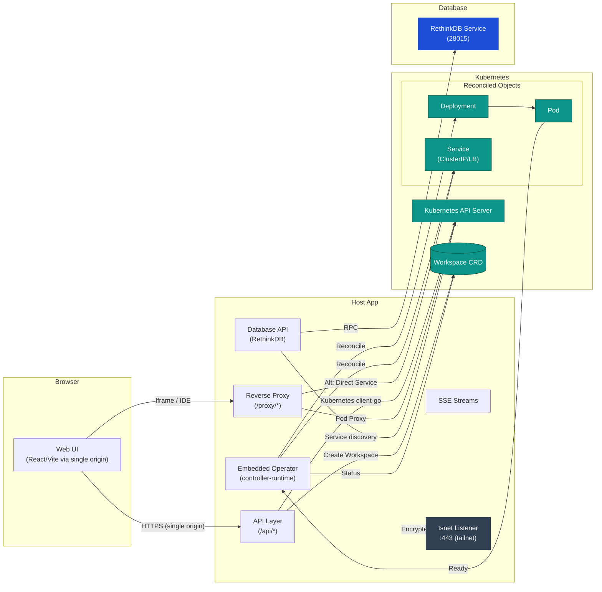
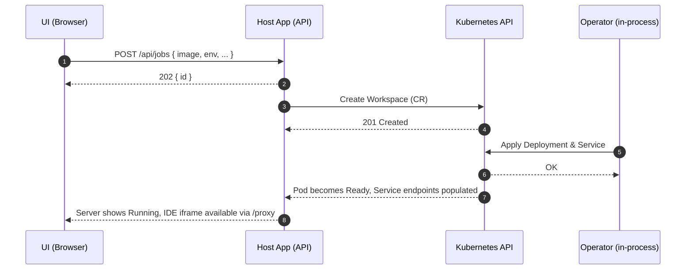
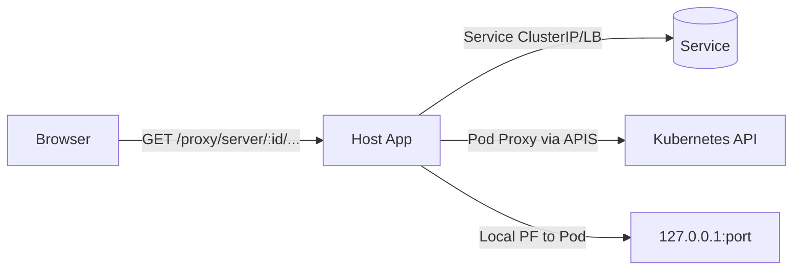
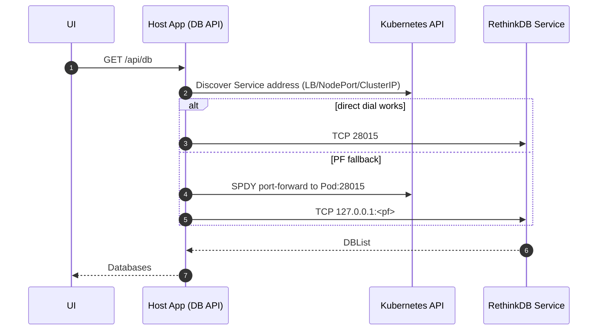

## GuildNet Architecture

GuildNet provides a single‑origin HTTPS Host App that manages Kubernetes Workspaces and a shared Database, exposing APIs, reverse proxying per‑Workspace UIs (e.g., IDEs), and offering optional tailnet access via Tailscale (tsnet). The Host App embeds a controller that reconciles a custom `Workspace` resource into Deployments and Services. All browser traffic terminates on the Host App for a consistent security boundary.

### Component Overview

Key properties

- Single HTTPS origin: UI, APIs, logs, and proxied IDEs share one origin for cookies and security headers.
- Embedded Operator: a controller inside the Host App manages `Workspace` resources → Deployments and Services.
- Flexible reachability: traffic to Pods can go through the Kubernetes API server’s pod proxy, a Service ClusterIP/LB, or a managed port‑forward when needed.
- Database integration: a RethinkDB service is discovered from Kubernetes and exposed via Host App APIs for listing, creating databases, tables, and row operations.

### Connectivity & Discovery

Kubernetes client configuration (client‑go)

- In‑cluster: automatic when Host App runs inside the cluster.
- Out‑of‑cluster: reads kubeconfig (default `~/.guildnet/kubeconfig`).
- Proxy‑aware: if `HOSTAPP_API_PROXY_URL` is set (e.g., http://127.0.0.1:8001 from `kubectl proxy`), client‑go uses that endpoint for discovery and all Kubernetes API calls.
- NO_PROXY: recommended to include `localhost,127.0.0.1,10.0.0.0/8,.cluster.local` to avoid system proxies interfering with cluster traffic.

Workspace access (reverse proxy)

- Resolution order for `/proxy/server/{id}/...`:
  1. Target the Workspace Service (ClusterIP/LB) by labels/id.
  2. If the server declares `Env.AGENT_HOST`, use it (infers scheme by port: 8443 → https, else http).
  3. Fallback `<dns1123(name)>.${namespace}.svc.cluster.local` with a well‑known port (prefers 8080, else 8443, else first).
  4. When direct dialing is not viable, use the Kubernetes API server Pod Proxy.
  5. As a last resort, open a local SPDY port‑forward against the Pod and route via 127.0.0.1:
- Dual transports: the proxy uses a standard transport for direct/PF paths, and a Kubernetes API transport for pod‑proxy paths, with header rewrites tuned for iframe use (Location, Set‑Cookie, CSP, COOP/COEP).

Database (RethinkDB) service discovery

- Address precedence:
  1. `RETHINKDB_ADDR` (host:port) explicit override.
  2. If inside the cluster: `RETHINKDB_SERVICE_HOST`/`PORT` env vars, else `<service>.<namespace>.svc.cluster.local:28015`.
  3. Outside the cluster via kubeconfig:
     - Prefer Service LoadBalancer IP/hostname.
     - Fallback to NodePort + a node IP (ExternalIP, else InternalIP).
     - Fallback to Service ClusterIP if routed (e.g., via a tailnet subnet router).
     - If all else fails, and a Ready Pod exists, establish a temporary SPDY port‑forward to the Pod’s 28015 and use 127.0.0.1:<localport>.
- Robustness: short, bounded connection attempts; retries/backoff for `DBList`, `DBCreate`, and meta‑table creation to tolerate leader or startup timing.

### Control Plane and Reconciliation

- Custom Resource: `Workspace` with `spec.image`, optional env and ports.
- Operator:
  - Reconciles each `Workspace` to a Deployment and Service.
  - Security: non‑root, seccomp `RuntimeDefault`, `allowPrivilegeEscalation=false`, drop `ALL` capabilities.
  - Probes: readiness and liveness on `/` (first port), extended timings for slow starts; no StartupProbe.
  - Ports: heuristics for known IDE images (e.g., code‑server → 8080); otherwise expose 8080 and 8443.
  - Env: inject `PORT=8080` by default; set `PASSWORD` for code‑server if not provided.
  - Scheduling: tolerations for control‑plane taints (single‑node dev clusters).
  - Service: ClusterIP by default; LoadBalancer when `WORKSPACE_LB=true`; optional MetalLB address pool via `WORKSPACE_LB_POOL`.
  - Optional Ingress: when `WORKSPACE_DOMAIN` is set and LB disabled; TLS via `CERT_MANAGER_ISSUER` if configured.
  - Status: phase, ready replicas, service DNS, and a proxy target hint.
  - Conflict handling: idempotent reconciliation; subsequent loops converge changes.

### Request Flows

Workspace lifecycle

Proxy to Workspace

Database operations

### API Surface (selected)

Core

- GET `/healthz` — liveness
- GET `/api/ui-config` — minimal UI config
- GET `/api/images` — presets; GET `/api/image-defaults?image=<ref>`
- GET `/api/servers` — list servers; GET `/api/servers/{id}`; logs via `GET /api/servers/{id}/logs` and `GET /sse/logs`
- POST `/api/jobs` — create a Workspace
- POST `/api/admin/stop-all` — delete all managed workloads
- Reverse proxy: `/proxy?to=host:port&path=/...`, `/proxy/{to}/{rest}`, `/proxy/server/{id}/{rest}`

Database

- GET `/api/db/health` — {status, addr, error?}
- GET `/api/db` — list databases (per org)
- POST `/api/db` — create database {id, name?, description?}
- GET `/api/db/:dbId` — database info
- DELETE `/api/db/:dbId` — drop database
- Table/rows endpoints under `/api/db/:dbId/tables/...` including import, query, insert, update, delete
- GET `/sse/db/:dbId/tables/:table/changes` — changefeed (MVP)

### Security and Headers

- TLS: HTTPS on `LISTEN_LOCAL` for local access; HTTPS on `:443` inside tailnet via tsnet.
- Certificates: preferred order — `./certs/server.crt|server.key`, `./certs/dev.crt|dev.key`, or auto‑generated self‑signed under `~/.guildnet/state/certs/`.
- CORS: allow a single origin `FRONTEND_ORIGIN` (use `https://127.0.0.1:8080` in local dev).
- Reverse proxy hardening for iframes:
  - Adjust `Location` for subpaths.
  - Normalize `Set‑Cookie` (drop Domain, set `Secure`, `SameSite=None`, add `Partitioned`, fix Path).
  - Set COOP/COEP/CSP headers to be iframe‑compatible while safe.
- No built‑in auth: rely on tailnet + Kubernetes RBAC; add an external auth proxy for public exposure if needed.

### Deployment & Developer Workflow

- Prereqs: Kubernetes cluster reachable via kubeconfig or in‑cluster; MetalLB recommended for LoadBalancer Services; optional Tailscale subnet router for direct ClusterIP routing.
- Make tasks: build, run, test, lint; helpers to deploy MetalLB, CRDs, and RethinkDB.
- Startup (`scripts/run-hostapp.sh`):
  - Exports `KUBECONFIG` (default `~/.guildnet/kubeconfig`).
  - Starts `kubectl proxy` (localhost:8001) and exports `HOSTAPP_API_PROXY_URL` for client‑go.
  - Exports database discovery hints: `RETHINKDB_SERVICE_NAME`, `RETHINKDB_NAMESPACE`.
  - Enables embedded operator by default.
  - Runs the Host App.
- UI: open `https://127.0.0.1:8080` (the Host App proxies the dev UI for same‑origin UX).

### Environment Knobs (selected)

- `LISTEN_LOCAL` — local HTTPS bind address.
- `FRONTEND_ORIGIN` — allowed CORS origin.
- `HOSTAPP_API_PROXY_URL` — base URL for Kubernetes API (e.g., `http://127.0.0.1:8001`).
- `HOSTAPP_EMBED_OPERATOR` — run the embedded controller.
- `HOSTAPP_DISABLE_API_PROXY` — force direct ClusterIP dial where available.
- `HOSTAPP_USE_PORT_FORWARD` — enable port‑forward fallback for proxying.
- `K8S_NAMESPACE` — default namespace for Workspaces.
- `WORKSPACE_LB`, `WORKSPACE_LB_POOL`, `WORKSPACE_DOMAIN`, `INGRESS_CLASS_NAME`, `CERT_MANAGER_ISSUER` — exposure options.
- `RETHINKDB_ADDR` — explicit RethinkDB address override.
- `RETHINKDB_SERVICE_NAME`, `RETHINKDB_NAMESPACE` — database discovery hints.
- `NO_PROXY` — avoid proxying cluster traffic.

### Operational Notes

- Logs and diagnostics: structured per‑request logs with request id; health endpoints for Host App and Database.
- Port‑forwarding: implemented via client‑go SPDY to the API server; only used when direct Service/ClusterIP reachability is unavailable.
- Resilience: transient DB errors are retried with backoff; reverse proxy is tolerant to redirects and cookies in iframe contexts; Kubernetes discovery works via kubeconfig or a local API proxy.

### Limitations

- No built‑in user authentication; rely on tailnet and Kubernetes RBAC.
- DB storage uses an ephemeral volume by default (emptyDir).
- SSE streams are tail‑oriented with periodic heartbeats; no long‑lived watches for all resources.
- No StartupProbe; longer cold starts rely on tuned readiness/liveness.
- Workspace quotas/policies are not enforced beyond basic defaults.
