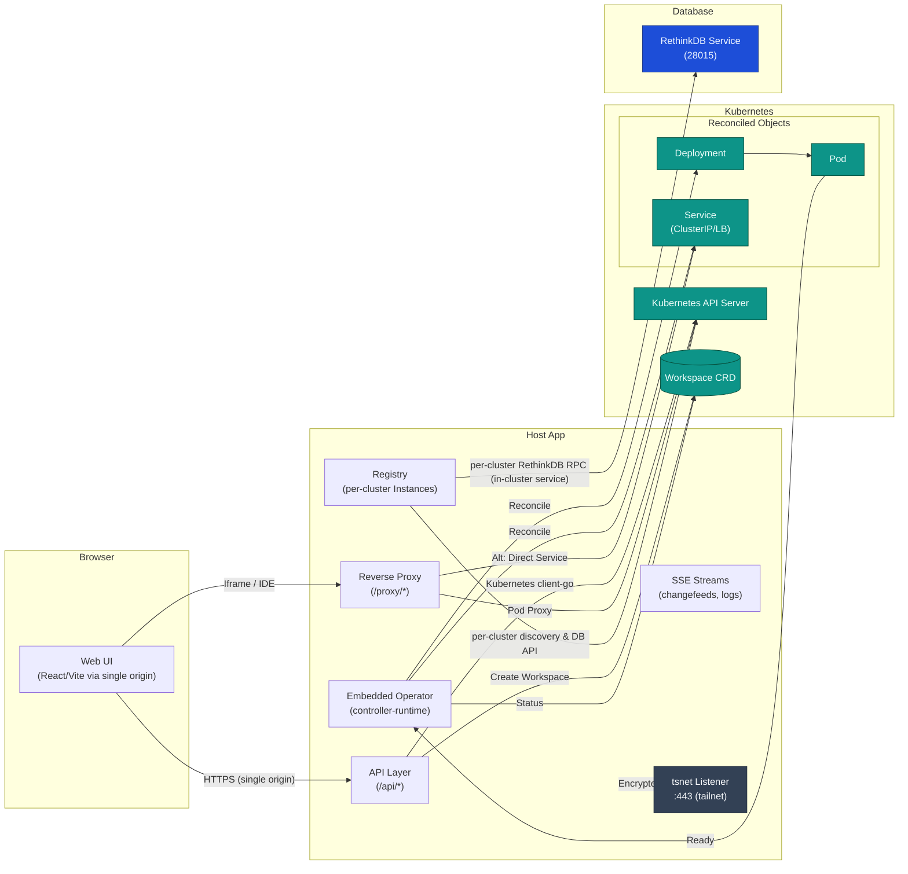
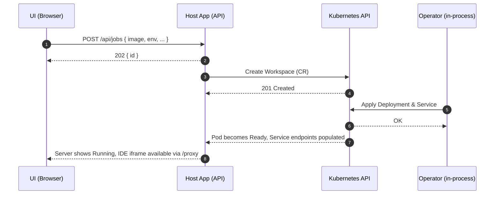
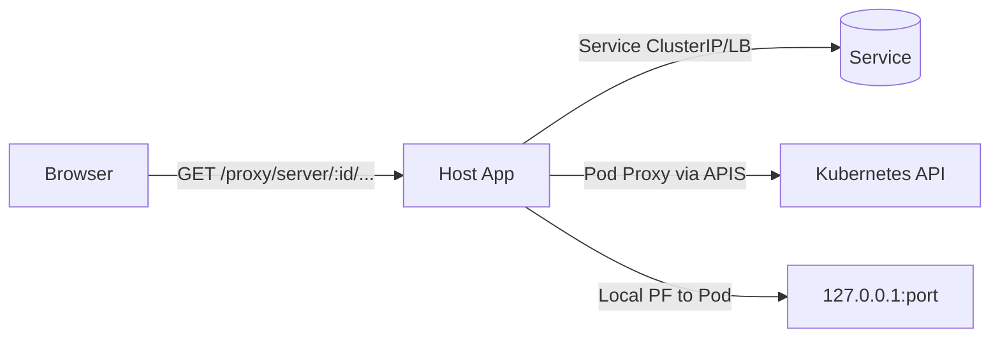
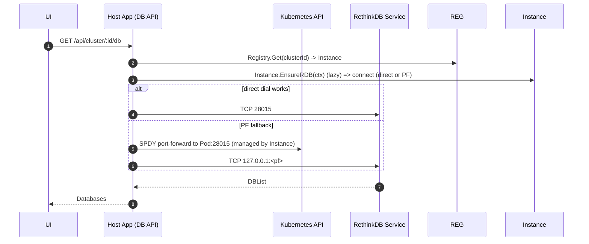

## GuildNet Architecture

GuildNet provides a single‑origin HTTPS Host App that manages Kubernetes Workspaces and per‑cluster database access. The Host App exposes APIs, reverse proxies per‑Workspace UIs (e.g., IDEs), and offers optional tailnet access via Tailscale (tsnet). It embeds an operator-like controller that reconciles a `Workspace` custom resource into Deployments and Services. All browser traffic terminates on the Host App for a consistent security boundary.

### Component Overview

Key properties

- Single HTTPS origin: UI, APIs, logs, and proxied IDEs share one origin for cookies and security headers.
- Embedded Operator: a controller inside the Host App manages `Workspace` resources → Deployments and Services.
- Per-cluster Instance model: the Host App maintains a `Registry` of per-cluster `Instance` objects. Each Instance holds the cluster-scoped local state (on-disk state dir), a Kubernetes client, a port-forward manager for that cluster, a per-cluster local DB (SQLite) and a lazily-initialized RethinkDB manager used by the DB HTTP API and changefeeds.
 - Flexible reachability: traffic to Pods can go through the Kubernetes API server’s pod proxy, a Service ClusterIP/LB, or a managed SPDY port‑forward when needed. RethinkDB connections MUST use an in-cluster Service and are not accessed via local SPDY port‑forwards.
 - Database integration: RethinkDB is discovered per-cluster via in-cluster service discovery; the Host App exposes a DB HTTP API per-cluster for database/table/row operations and SSE changefeeds.

Per-cluster Instance model (Registry)

- Registry: a thread-safe map of active cluster `Instance`s keyed by cluster id. The Host App creates an Instance on demand when a cluster-scoped API or operation is requested.
- Instance responsibilities:
  - localdb: per-cluster SQLite used for lightweight host-side state and caching (stored under the Host App state dir with a cluster subdirectory).
  - k8s client: a cluster-scoped `client-go` configured from kubeconfig or in-cluster settings.
  - port-forward manager: cluster-scoped manager that tracks SPDY port‑forwards and prevents duplicate forwards for the same pod/port.
  - RDB manager: an interface-typed wrapper around the RethinkDB client that is created lazily by calling `EnsureRDB` (in-cluster discovery + connect). `EnsureRDB` requires an in-cluster service address and does not create local SPDY port‑forwards.
  - background workers: changefeed consumers, processors and other long-running goroutines are started bound to the Instance's context so they stop automatically when the Instance is closed.
  - lifecycle: each Instance has its own context/cancel and a waitgroup. `Registry.Close(clusterID)` cancels the Instance context, closes local and remote DB connections, tears down port-forwards for that Instance and waits for background workers to exit.

This per-cluster model guarantees resource isolation between clusters and makes shutdown/restart deterministic for each cluster.

### Connectivity & Discovery

Kubernetes client configuration (client‑go)

- In‑cluster: automatic when Host App runs inside the cluster.
- Out‑of‑cluster: reads kubeconfig (default `~/.guildnet/kubeconfig`).
- Proxy‑aware: if `HOSTAPP_API_PROXY_URL` is set (e.g., http://127.0.0.1:8001 from `kubectl proxy`), client‑go uses that endpoint for discovery and all Kubernetes API calls.
- NO_PROXY: recommended to include `localhost,127.0.0.1,10.0.0.0/8,.cluster.local` to avoid system proxies interfering with cluster traffic.

Workspace access (reverse proxy)

- Resolution order for `/proxy/server/{id}/...`:
  1. Target the Workspace Service (ClusterIP/LB) by labels/id.
  2. If the server declares `Env.AGENT_HOST`, use it (infers scheme by port: 8443 → https, else http).
  3. Fallback `<dns1123(name)>.${namespace}.svc.cluster.local` with a well‑known port (prefers 8080, else 8443, else first).
  4. When direct dialing is not viable, use the Kubernetes API server Pod Proxy.
  5. As a last resort, open a local SPDY port‑forward against the Pod and route via 127.0.0.1:
- Dual transports: the proxy uses a standard transport for direct/PF paths, and a Kubernetes API transport for pod‑proxy paths, with header rewrites tuned for iframe use (Location, Set‑Cookie, CSP, COOP/COEP).

Database (RethinkDB) service discovery and connection

- RethinkDB MUST run inside the Talos/Kubernetes cluster. The Host App discovers the DB via in-cluster service discovery and connects to the service address (ClusterIP / LoadBalancer / NodePort) for the configured `RETHINKDB_SERVICE_NAME` and `RETHINKDB_NAMESPACE`.

- Address resolution notes:
  - When running in-cluster the Host App prefers `RETHINKDB_SERVICE_HOST`/`RETHINKDB_SERVICE_PORT` or DNS name `<service>.<namespace>.svc.cluster.local:28015`.
  - When running with a kubeconfig the Host App performs Kubernetes service discovery and expects to resolve to a cluster-reachable address (LB/NodePort/ClusterIP). The Host App will fail if the service is not resolvable as an in-cluster reachable address.

- Lazy initialization and monitor:
  - The Instance lazily creates a per-cluster RethinkDB manager when the DB API or a changefeed is first requested (`EnsureRDB`).
  - Connections are established with bounded retries and exponential backoff for transient failures.
  - A per-Instance monitor pings the RethinkDB manager at a configurable interval and classifies errors (transient vs fatal). On transient errors it will attempt reconnection; on fatal errors it surfaces the state to logs/metrics and stops reconnecting.

- Robustness: operations that modify DB meta (create DB/table, ensure meta tables) use short, bounded retry loops so the Host App can tolerate brief startup races or leader elections.

### Control Plane and Reconciliation

- Custom Resource: `Workspace` with `spec.image`, optional env and ports.
- Operator:
  - Reconciles each `Workspace` to a Deployment and Service.
  - Security: non‑root, seccomp `RuntimeDefault`, `allowPrivilegeEscalation=false`, drop `ALL` capabilities.
  - Probes: readiness and liveness on `/` (first port), extended timings for slow starts; no StartupProbe.
  - Ports: heuristics for known IDE images (e.g., code‑server → 8080); otherwise expose 8080 and 8443.
  - Env: inject `PORT=8080` by default; set `PASSWORD` for code‑server if not provided.
  - Scheduling: tolerations for control‑plane taints (single‑node dev clusters).
  - Service: ClusterIP by default; LoadBalancer when `WORKSPACE_LB=true`; optional MetalLB address pool via `WORKSPACE_LB_POOL`.
  - Optional Ingress: when `WORKSPACE_DOMAIN` is set and LB disabled; TLS via `CERT_MANAGER_ISSUER` if configured.
  - Status: phase, ready replicas, service DNS, and a proxy target hint.
  - Conflict handling: idempotent reconciliation; subsequent loops converge changes.

### Request Flows

Workspace lifecycle

Proxy to Workspace

Database operations (per cluster)

### API Surface (selected)

Core

- GET `/healthz` — liveness
- GET `/api/ui-config` — minimal UI config
- GET `/api/images` — presets; GET `/api/image-defaults?image=<ref>`
- GET `/api/servers` — list servers; GET `/api/servers/{id}`; logs via `GET /api/servers/{id}/logs` and `GET /sse/logs`
- POST `/api/jobs` — create a Workspace
- POST `/api/admin/stop-all` — delete all managed workloads
- Reverse proxy: `/proxy?to=host:port&path=/...`, `/proxy/{to}/{rest}`, `/proxy/server/{id}/{rest}`

Database (per-cluster)

- GET `/api/cluster/{clusterId}/db` — list databases for the cluster
- POST `/api/cluster/{clusterId}/db` — create database {id, name?, description?}
- GET `/api/cluster/{clusterId}/db/:dbId` — database info
- DELETE `/api/cluster/{clusterId}/db/:dbId` — drop database
- Table/rows endpoints under `/api/cluster/{clusterId}/db/:dbId/tables/...` including import, query, insert, update, delete
- GET `/sse/cluster/{clusterId}/db/:dbId/tables/:table/changes` — changefeed (MVP)

Wiring and how the pieces connect

 - HTTP router: when cluster-scoped APIs are hit the router calls `Registry.Get(clusterId)` to obtain the Instance for that cluster. If the endpoint needs RethinkDB access the router invokes `Instance.EnsureRDB(ctx)` which performs in-cluster discovery and connects to the configured in-cluster service. The same Instance (and its RDB manager) is used for HTTP handlers and SSE changefeeds.
- Background workers & changefeeds: workers are started per-Instance and inherit the Instance context so cancelling the Instance stops all cluster-scoped activity. This ensures predictable shutdown and garbage-free lifecycle.
 - Port-forward lifecycle: port-forwards are tracked and de-duplicated within the Instance. Forwards are used for reverse-proxying browser/IDE traffic to pods when direct dialing is not viable; they are not used to reach RethinkDB.

Observability and metrics

- Per-cluster metrics: the Host App records operation counters and health metrics with a per-cluster prefix so dashboards and alerts can be scoped to a specific cluster. A Snapshot/exporter endpoint exposes merged metrics for Prometheus scraping or inspection.
- Health endpoints: `/healthz` for overall process health and additional cluster-scoped health endpoints surface per-Instance RethinkDB connectivity and localdb health.

### Security and Headers

- TLS: HTTPS on `LISTEN_LOCAL` for local access; HTTPS on `:443` inside tailnet via tsnet.
- Certificates: preferred order — `./certs/server.crt|server.key`, `./certs/dev.crt|dev.key`, or auto‑generated self‑signed under `~/.guildnet/state/certs/`.
- CORS: allow a single origin `FRONTEND_ORIGIN` (use `https://127.0.0.1:8090` in local dev).
- Reverse proxy hardening for iframes:
  - Adjust `Location` for subpaths.
  - Normalize `Set‑Cookie` (drop Domain, set `Secure`, `SameSite=None`, add `Partitioned`, fix Path).
  - Set COOP/COEP/CSP headers to be iframe‑compatible while safe.
- No built‑in auth: rely on tailnet + Kubernetes RBAC; add an external auth proxy for public exposure if needed.

### Deployment & Developer Workflow

- Prereqs: Kubernetes cluster reachable via kubeconfig or in‑cluster; MetalLB recommended for LoadBalancer Services; optional Tailscale subnet router for direct ClusterIP routing.
- Make tasks: build, run, test, lint; helpers to deploy MetalLB, CRDs, and RethinkDB.
- Startup (`scripts/run-hostapp.sh`):
  - Exports `KUBECONFIG` (default `~/.guildnet/kubeconfig`).
  - Starts `kubectl proxy` (localhost:8001) and exports `HOSTAPP_API_PROXY_URL` for client‑go.
  - Exports database discovery hints: `RETHINKDB_SERVICE_NAME`, `RETHINKDB_NAMESPACE`.
  - Enables embedded operator by default.
  - Runs the Host App.
- UI: open `https://127.0.0.1:8090` (the Host App proxies the dev UI for same‑origin UX).

### Environment Knobs (selected)

- `LISTEN_LOCAL` — local HTTPS bind address.
- `FRONTEND_ORIGIN` — allowed CORS origin.
- `HOSTAPP_API_PROXY_URL` — base URL for Kubernetes API (e.g., `http://127.0.0.1:8001`).
- `HOSTAPP_EMBED_OPERATOR` — run the embedded controller.
- `HOSTAPP_DISABLE_API_PROXY` — force direct ClusterIP dial where available.
- `HOSTAPP_USE_PORT_FORWARD` — enable port‑forward fallback for proxying.
- `K8S_NAMESPACE` — default namespace for Workspaces.
- `WORKSPACE_LB`, `WORKSPACE_LB_POOL`, `WORKSPACE_DOMAIN`, `INGRESS_CLASS_NAME`, `CERT_MANAGER_ISSUER` — exposure options.
- `RETHINKDB_ADDR` — explicit RethinkDB address override.
- `RETHINKDB_SERVICE_NAME`, `RETHINKDB_NAMESPACE` — database discovery hints.
- `NO_PROXY` — avoid proxying cluster traffic.

### Operational Notes

- Logs and diagnostics: structured per‑request logs with request id; health endpoints for Host App and Database.
- Port‑forwarding: implemented via client‑go SPDY to the API server; only used when direct Service/ClusterIP reachability is unavailable.
- Resilience: transient DB errors are retried with backoff; reverse proxy is tolerant to redirects and cookies in iframe contexts; Kubernetes discovery works via kubeconfig or a local API proxy.

### Limitations

- No built‑in user authentication; rely on tailnet and Kubernetes RBAC.
- DB storage uses an ephemeral volume by default (emptyDir).
- SSE streams are tail‑oriented with periodic heartbeats; no long‑lived watches for all resources.
- No StartupProbe; longer cold starts rely on tuned readiness/liveness.
- Workspace quotas/policies are not enforced beyond basic defaults.
