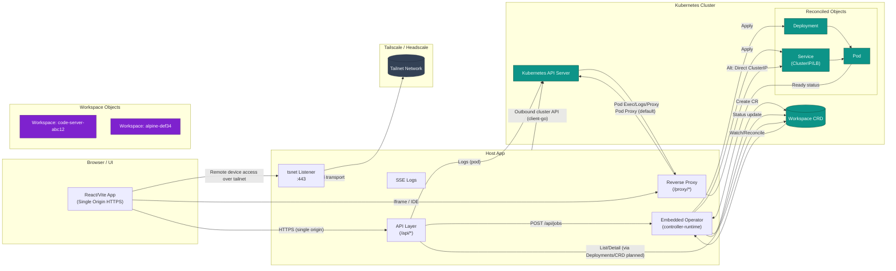
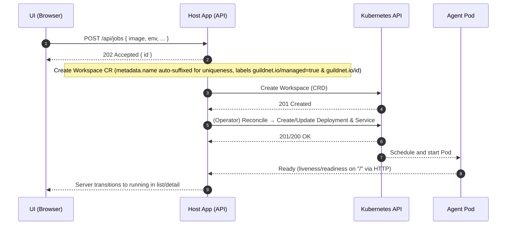
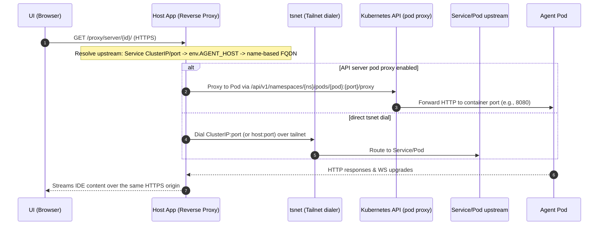

## GuildNet Architecture

GuildNet runs ephemeral or semi-persistent Workspaces (container images) in a Kubernetes cluster, surfaced through a single HTTPS origin provided by the Host App (Go + embedded Tailscale/tsnet). The Host App creates a custom `Workspace` resource; an embedded controller reconciles each `Workspace` into a Deployment and Service. All browser interactions terminate at the Host App, which exposes an API and a reverse proxy for per‑Workspace UIs.

### Component Overview Diagram

#### Diagram Notes
* Pod proxy (API server path) is the primary access method; direct ClusterIP over tsnet is an optional fallback when routing permits.
* The Operator runs inside the Host App process; no separate controller deployment.
* Multiple `Workspace` resources are independently reconciled into their own Deployments and Services.
* The single HTTPS origin ensures cookies, future auth headers, and iframe content share one security context.
* Tailscale provides remote, secure access without requiring a public ingress.

### Capabilities
* Launch container images by creating a `Workspace` resource with minimal required fields (primarily `spec.image`).
* Provide a single-origin HTTPS proxy for all Workspace traffic (including iframe-based IDEs) via the Host App.
* Support multi-device access over a tailnet (Tailscale/Headscale) without built-in per‑user authentication.
* Apply capability-style permission gating for destructive actions (e.g., stop-all).
* Stabilize first-start behavior for slower images (e.g., code-server) via tuned readiness and liveness probes.
* Allow multiple simultaneous instances of the same image through unique, auto‑suffixed names.

### Unimplemented Features
* Authentication / per-user access control (rely on tailnet + Kubernetes RBAC).
* CRD Conditions (only phase and counts are exposed).
* Metrics, tracing, auditing.
* External ingress automation and DNS beyond optional per‑workspace Ingress.
* Persistent storage provisioning / volume claims.
* Advanced policy (image and port constraints, concurrency limits, resource quotas per user).
* Configurable probe timing and startup probes via API (static defaults in use).
* Tightened CRD schema for `spec.env` (permissive; sanitation occurs in operator).

### Components

- How to access the UI
  - Local development: open `https://127.0.0.1:8080`. The Host App proxies the Vite dev server (which listens on `https://localhost:5173`) so the browser uses a single HTTPS origin.
  - Tailnet: open `https://<hostapp-ts-fqdn>:443`. Ensure your server certificate includes your tailnet FQDN/IP to avoid warnings, or front the Host App with a trusted proxy.

- Client UI (Vite + SolidJS)
  - Launch form posts to the Host App; simple defaults, advanced options on demand.
  - Servers list/detail with logs and an IDE tab (iframe via the proxy).
  - API base configured via `VITE_API_BASE`; dev UI is also reverse-proxied by the Host App for same-origin dev.

#### Host App (Go + tsnet)
  - Local TLS listener (default `LISTEN_LOCAL=127.0.0.1:8080`) and a tsnet listener on `:443` inside the tailnet.
  - CORS is restricted to a single origin via `FRONTEND_ORIGIN` (for dev use the Host App origin `https://127.0.0.1:8080`).
  - Endpoints:
    - `GET /healthz` — liveness
    - `GET /api/ui-config` — minimal UI config (e.g., name)
    - `GET /api/images` — list deployable images (server-sourced presets)
    - `GET /api/image-defaults?image=<ref>` — suggested env/ports for known images
    - `GET /api/servers` — list managed servers (from Kubernetes)
    - `GET /api/servers/{id}` — server detail
    - `GET /api/servers/{id}/logs?level=&limit=` — recent log lines
    - `POST /api/jobs` — create/update a Deployment + Service from a JobSpec
    - `POST /api/admin/stop-all` (also `/api/stop-all`) — delete all managed workloads
    - `GET /sse/logs?target=&level=&tail=` — logs over Server-Sent Events (tail + heartbeats)
    - `GET /api/proxy-debug` — echo helper for diagnosing proxy inputs
    - Reverse proxy:
      - `/proxy?to=host:port&path=/...` (query form)
      - `/proxy/{to}/{rest}` (path form)
      - `/proxy/server/{id}/{rest}` (server-aware form)
  - Dev UI reverse-proxy: requests to `/` are forwarded to the Vite dev server (which listens on `https://localhost:5173`), while `/api/*`, `/proxy/*`, and `/healthz` are handled by the Host App. In practice, you should open `https://127.0.0.1:8080` in the browser; the Host App will proxy the UI for a single, secure origin.

#### Tailscale (Headscale/Tailscale)
  - The Host App authenticates via tsnet using configured login server and auth key.
  - Provides tailnet transport; recommend a subnet router for reaching cluster CIDRs.

#### Kubernetes Cluster, Workspace CRD & Embedded Operator
  - The Host App uses in-cluster config when running inside the cluster, or falls back to `KUBECONFIG` (client-go) when outside.
  - Launch requests (`POST /api/jobs`) create a `Workspace` custom resource.
  - An embedded controller-runtime manager watches `Workspace` objects and reconciles each into a Deployment and Service (and optional Ingress or LoadBalancer) following defaulting and hardening rules.
  - Status (ready replicas, service DNS, proxy resolution) is written to `Workspace.status` and surfaced via server list/detail endpoints; additional direct Workspace endpoints can be added.

#### Workspace Images
  - Typically code-server behind Caddy, listening on HTTP 8080; other images are supported by configuration.

### High-Level Data Flow
Browser → Host App API → Workspace CR (Kubernetes API) → Operator Reconcile → Deployment + Service → Host App Reverse Proxy → Browser iframe.

Notes
- Browser ↔ Host App uses HTTPS on a single origin.
- The Host App dials cluster services via tsnet; for cluster-internal access it can go direct (ClusterIP) or via the Kubernetes API server pod proxy.
- The reverse proxy preserves method/body and handles WebSockets; cookies and redirects are adjusted for iframe use.

Multi-device model
- The Host App serves the UI locally on `https://127.0.0.1:8080` and on `:443` over the tailnet. Any device in the tailnet can open the URL and operate against the same Kubernetes cluster.
- The Host App’s kubeconfig determines cluster access and permissions. There is no built‑in per-user authentication; tailnet boundaries and Kubernetes RBAC provide access control.

Environment assumptions
- A Kubernetes cluster is reachable (in-cluster config or `KUBECONFIG`).
- A Tailscale/Headscale control plane is available for the Host App’s tsnet.
- For private Service access by ClusterIP from outside the cluster, a Tailscale subnet router (advertising cluster CIDRs) is recommended.

Kubernetes reachability modes
- API server Pod Proxy (default) — the Host App uses client‑go to request `.../pods/<pod>:<port>/proxy` to reach the container. This works even when ClusterIP ranges are not routed to the Host machine.
- Direct ClusterIP over tsnet — set `HOSTAPP_DISABLE_API_PROXY=true` to bypass the API proxy and dial the ClusterIP:port via tsnet. This requires a route (for example, a Tailscale subnet router advertising the cluster CIDRs). Useful to validate WebSockets and long‑lived connections end‑to‑end.

### Workspace Launch Flow

The launch UI deploys a container in the cluster (Deployment and Service) and makes it reachable through the Host App proxy.

### Operator Defaults & Hardening
Applied during reconciliation of a `Workspace`:
* Image: `spec.image` required (no implicit default).
* Ports:
  * If image resembles code-server (heuristic) expose only 8080.
  * Otherwise expose 8080 (HTTP) and 8443 (HTTPS).
  * Readiness/Liveness target `/` on first port (usually 8080).
* Probes: Extended initial delay and period for slower first-start images to reduce churn. No StartupProbe is configured.
* Environment:
  * Blank / empty-name env entries are sanitized out (both API handler and operator layer).
  * Inject `PORT=8080` if missing.
  * Inject `PASSWORD` from `AGENT_DEFAULT_PASSWORD` (or `changeme`) if the image pattern suggests code-server and it's unset.
* Security Context:
  * Non-root user, drop ALL capabilities, `seccompProfile: RuntimeDefault`, `allowPrivilegeEscalation=false`.
* Scheduling:
  * Explicit toleration added for single-node (control-plane taint) dev clusters; reconciler overwrites to prevent drift accumulation.
* Service:
  * Mirrors container ports.
  * Type ClusterIP by default; LoadBalancer if `WORKSPACE_LB` set (MetalLB assumed). Optional pool via `WORKSPACE_LB_POOL`.
* Optional Ingress (when `WORKSPACE_DOMAIN` set and no LB):
  * Uses `INGRESS_CLASS_NAME` (default `nginx`).
  * If `CERT_MANAGER_ISSUER` present, requests a TLS cert (`workspace-<id>-tls`).
  * Optional NGINX auth annotations via `INGRESS_AUTH_URL` & `INGRESS_AUTH_SIGNIN`.
* Status:
  * `status.phase` (e.g., Pending → Running), `status.readyReplicas`, `status.serviceDNS`, `status.proxyTarget` updated each reconcile.
* Conflict Handling:
  * Relies on the next reconcile after Deployment update conflicts.

### Access Flow (Proxy → Workspace)

The server detail page’s IDE tab loads an iframe whose src points at the Host App’s `/proxy`. The Host App resolves the upstream and streams the agent’s UI back to the browser.

#### Browser Integration
- The iframe src is the Host App’s HTTPS origin, avoiding mixed content.
- The reverse proxy adjusts redirects (Location) and Set-Cookie for iframe scenarios (drops Domain, ensures `Secure` and `SameSite=None`, adds `Partitioned`, and normalizes Path).

### Proxy Resolution Order

- Resolution order for `/proxy/server/{id}/...`:
  1) Try direct Service ClusterIP + port from Kubernetes by id/name or label `guildnet.io/id`.
  2) If the server has `Env.AGENT_HOST`:
     - If it includes `host:port`, infer scheme: 8443 → https, otherwise http.
     - If it’s a bare host, pick a port from the known server ports: prefer 8080 then 8443, else first; infer scheme accordingly.
  3) Fallback: derive host from server name as `<dns1123(name)>.default.svc.cluster.local`, choose port as above, and infer scheme.
  4) If none of the above yields a target, an error is returned instructing to set `Env.AGENT_HOST` or ensure a Service/ports exist.

- Explicit form `/proxy?to=host:port&path=/...` is also available.

* No allowlist: rely on tailnet + cluster RBAC.

Certificates and hostnames for multi-device access
- The Host App serves HTTPS using, in order of preference:
  1) `./certs/server.crt|server.key` (recommended for dev with your own CA)
  2) `./certs/dev.crt|dev.key` (repo dev certs)
  3) `~/.guildnet/state/certs/server.crt|server.key` (auto‑generated self‑signed)
- For other devices in the tailnet to connect without warnings, include the Host App’s tailnet FQDN and/or Tailscale IP in the server cert SANs. Use `scripts/generate-server-cert.sh -H "localhost,127.0.0.1,::1,<ts-fqdn>,<ts-ip>" -f`.
- Alternatively, terminate TLS in front of the Host App with a proxy that has a trusted certificate and forwards to the Host App locally.

### Workspace CRD Responsibilities (Operator Summary)

On creation/update of a `Workspace`:
* Ensure Deployment + Service exist & match spec/defaulted fields.
* Enforce security context & tolerations (idempotent overwrite each reconcile).
* Normalize env (filter blanks, inject defaults) before applying Deployment.
* Configure health probes with extended timing to minimize false negatives.
* Record status fields reflecting live workload state (phase, ready replica count, service DNS, inferred proxy target).
* Leave advanced features (conditions array, metrics, startupProbe, cleanup/TTL) for future iterations.

Current limitations:
* No `kubectl describe workspace <name>` condition reasons beyond coarse phase.
* CRD schema allows `{}` in `spec.env` (operator filters but validation not enforced at schema level).
* No native stop/TTL lifecycle on the custom resource itself (stop-all operates by label selection).

### Listing & Logs
- `GET /api/servers` maps Deployments labeled `guildnet.io/managed=true` to `model.Server`.
  - Status is `running` when `ReadyReplicas > 0`, else `pending`.
  - Ports are taken from the corresponding Service when present.
  - `URL` is set to `https://<id>.<WORKSPACE_DOMAIN>/` when a domain is configured; if the Service has a LoadBalancer IP/hostname, it becomes `http(s)://<lb-ip-or-host>:<port>/`.
- `GET /api/servers/{id}/logs` returns recent log lines from the server’s first Pod.
- `GET /sse/logs` streams a tail of logs first, then heartbeats every 20s (no live k8s watch yet).
- `POST /api/admin/stop-all` deletes Deployments and Services labeled `guildnet.io/managed=true` in the namespace.

### Security & TLS

- Host App listeners:
  - Local HTTPS at `LISTEN_LOCAL` (default from config; can override via env)
  - tsnet HTTPS on `:443` inside the tailnet
- Certificates preference:
  1) `./certs/server.crt|server.key` (repo CA-signed)
  2) `./certs/dev.crt|dev.key`
  3) `~/.guildnet/state/certs/server.crt|server.key` (auto-generated self-signed for dev)
- CORS: only `FRONTEND_ORIGIN` is allowed (for local dev, set to `https://127.0.0.1:8080`).
- API server proxy: when enabled (default), traffic to cluster Pods can traverse the Kubernetes API server via client-go with TLS; HTTP/2 is disabled on that path to avoid INTERNAL_ERROR on proxy endpoints.
- Cookies/redirects are adjusted by the proxy for iframe usage, as noted above.

### Multi-User Notes
Access control relies on:
  - Tailnet boundary (who can reach the Host App over Tailscale/Headscale)
  - Kubernetes RBAC applied to the kubeconfig used by the Host App
  - Optional per‑workspace Ingress authentication when exposing via `WORKSPACE_DOMAIN`
If exposing outside the tailnet, add an authentication proxy in front (for example, an OIDC‑enabled reverse proxy) or run the Host App behind a private ingress.

### Troubleshooting

- Proxy 502 / upstream error
  - Verify target resolution for `/proxy/server/{id}/...` (Service exists, ports populated, or `Env.AGENT_HOST` set).
  - If using direct ClusterIP without a subnet router, ensure the Host App is inside the cluster or has a route (via tsnet + subnet router).
  - Try `/api/proxy-debug` to confirm parameters reaching the proxy layer.

- IDE iframe doesn’t load
  - Confirm `/api/servers` shows the server `running`.
  - Check `curl -k https://127.0.0.1:8080/healthz` locally.
  - With API proxy enabled, ensure the Pod is Ready; the Host App prefers pod proxy.

- Logs SSE appears idle
  - On open, you’ll receive a tail dump; subsequent heartbeats are sent every 20s. Use the REST logs endpoint to refresh recent history.

- CORS errors
  - Ensure the UI origin matches `FRONTEND_ORIGIN`.
 - Remote tailnet device gets TLS warning
   - Regenerate the server certificate to include your tailnet FQDN and/or IP in SANs, or front the Host App with a TLS‑terminating proxy with a trusted cert.

### Ports

- Host App: HTTPS on `LISTEN_LOCAL` (e.g., `127.0.0.1:8080`) and HTTPS via tsnet on `:443` inside the tailnet.
- Agent (typical): HTTP on 8080; HTTPS 8443 optional depending on image/config.
- Proxying: HTTP or HTTPS to upstream depending on resolved port or explicit `scheme`.

### Multi-Device Access
- Local dev: open `https://127.0.0.1:8080` in the browser. The Vite dev server runs on `https://localhost:5173` but is proxied at `/` by the Host App for same-origin access.
- Tailnet: `https://<hostapp-ts-fqdn>:443` (same UI, single origin). Ensure the TLS cert includes the tailnet name/IP or use a trusted front proxy.

### Multiple Workspaces & Name Generation

* Each launch creates a distinct `Workspace` object; the operator reconciles them independently.
* Names: A base name (derived from image or user input) is suffixed with a random 5‑hex token (`<base>-<aaaaa>`) to avoid collisions and permit multiple simultaneous instances of the same image.
* The label `guildnet.io/id` mirrors the name for discovery; the UI lists these servers, and the IDE iframe targets `/proxy/server/{name}/...`.
* On collision, the API handler retries with a new suffix up to a bounded attempt limit.

### Environment Assumptions

- The code supports any Kubernetes cluster (in-cluster or kubeconfig). If you use Talos, helper scripts in `scripts/` can provision a dev cluster and a Tailscale subnet router.
- The Host App reads config via `pkg/config` (tsnet login server, auth key, hostname, listen address). A shared `.env` can be used by scripts to populate this config.

### Useful Environment Variables

- Service DNS fallback: `<dns1123(name)>.default.svc.cluster.local`
- Default agent ports when unspecified: 8080 (http), optionally 8443 (https)
- Example UI iframe src: `https://<hostapp>/proxy/server/{id}/`
- Useful env flags:
  - `LISTEN_LOCAL` — local HTTPS bind (e.g., `127.0.0.1:8080`)
  - `FRONTEND_ORIGIN` — CORS allow origin (use `https://127.0.0.1:8080` for local dev)
  - `UI_DEV_ORIGIN` — dev UI origin reverse-proxied at `/` (Vite runs on `https://localhost:5173` by default)
  - `WORKSPACE_LB` — expose Services as LoadBalancer (`1`/`true`)
  - `WORKSPACE_LB_POOL` — MetalLB address pool name
  - `WORKSPACE_DOMAIN` — per-workspace Ingress base domain (when not using LB)
  - `INGRESS_CLASS_NAME` — IngressClass for workspace ingresses (defaults to `nginx` if empty)
  - `CERT_MANAGER_ISSUER` — cert-manager issuer for per-workspace TLS
  - `K8S_IMAGE_PULL_SECRET` — imagePullSecret name for workloads
  - `AGENT_DEFAULT_PASSWORD` — default agent password when not provided
  - `HOSTAPP_DISABLE_API_PROXY` — disable Kubernetes API server proxy (force direct tsnet dial)

### Limitations
* No built-in user authentication layer (tailnet boundary + Kubernetes RBAC only).
* Logs SSE tail-only; no continuous live follow beyond heartbeats.
* Environment and port enrichment are minimal; CRD schema is permissive for env objects.
* No metrics, tracing, or structured Workspace Conditions.
* No StartupProbe; long cold starts rely on tuned readiness and liveness delays.
* No dedicated `/api/workspaces` endpoints (server list abstraction surfaces status indirectly).
* Conflict retries rely on subsequent reconciliations without explicit backoff.
