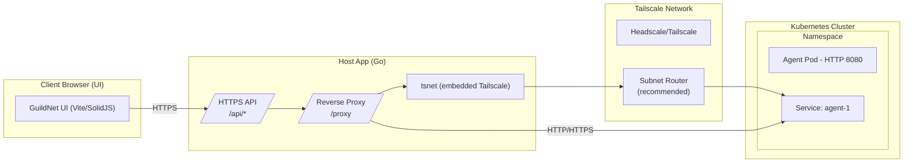
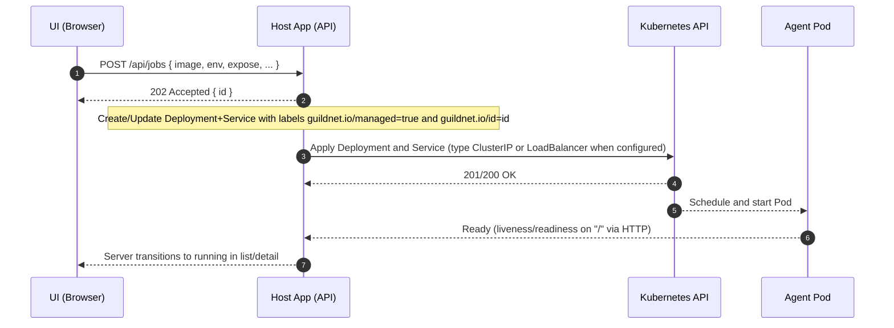
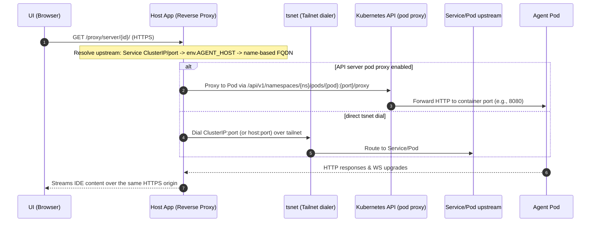

## GuildNet architecture

This document describes the end-to-end flow as implemented in the repository: launching workloads into a Kubernetes cluster and accessing each agent’s UI through a single HTTPS origin provided by the Host App (Go) using embedded Tailscale (tsnet).

Goals
- Launch agent containers dynamically in Kubernetes (Deployment + Service per workload).
- Reach each agent privately over the tailnet; browser only talks to the Host App over HTTPS.
- Use the Host App as the single browser-visible origin; it proxies to agents.
- Provide a simple web UI to list servers, view logs, and launch new workloads.

## Components

- Client UI (Vite + SolidJS)
  - Launch form posts to the Host App; simple defaults, advanced options on demand.
  - Servers list/detail with logs and an IDE tab (iframe via the proxy).
  - API base configured via `VITE_API_BASE`; dev UI is also reverse-proxied by the Host App for same-origin dev.

- Host App (Go + tsnet)
  - Local TLS listener (default `LISTEN_LOCAL=127.0.0.1:8080`) and a tsnet listener on `:443` inside the tailnet.
  - CORS is restricted to a single origin via `FRONTEND_ORIGIN` (default `https://localhost:5173`).
  - Endpoints (current implementation):
    - `GET /healthz` — liveness
    - `GET /api/ui-config` — minimal UI config (e.g., name)
    - `GET /api/images` — list deployable images (server-sourced presets)
    - `GET /api/image-defaults?image=<ref>` — suggested env/ports for known images
    - `GET /api/servers` — list managed servers (from Kubernetes)
    - `GET /api/servers/{id}` — server detail
    - `GET /api/servers/{id}/logs?level=&limit=` — recent log lines
    - `POST /api/jobs` — create/update a Deployment + Service from a JobSpec
    - `POST /api/admin/stop-all` (also `/api/stop-all`) — delete all managed workloads
    - `GET /sse/logs?target=&level=&tail=` — logs over Server-Sent Events (tail + heartbeats)
    - `GET /api/proxy-debug` — echo helper for diagnosing proxy inputs
    - Reverse proxy:
      - `/proxy?to=host:port&path=/...` (query form)
      - `/proxy/{to}/{rest}` (path form)
      - `/proxy/server/{id}/{rest}` (server-aware form)
  - Dev UI reverse-proxy: requests to `/` are forwarded to the Vite server (default `https://localhost:5173`), while `/api/*`, `/proxy/*`, and `/healthz` are handled by the Host App.

- Tailscale control plane (Headscale or Tailscale)
  - The Host App authenticates via tsnet using configured login server and auth key.
  - Provides tailnet transport; recommend a subnet router for reaching cluster CIDRs.

- Kubernetes cluster
  - The Host App uses in-cluster config when running inside the cluster, or falls back to `KUBECONFIG` (client-go) when outside.
  - It creates/updates Deployments and Services and reads Pods/Logs via the API.

- Agent container image (images/agent)
  - Typically code-server behind Caddy, listening on HTTP 8080; other images are supported by configuration.

## High-level view

Notes
- Browser ↔ Host App is always HTTPS on a single origin.
- Host App dials cluster services via tsnet; for cluster-internal access it can go direct (ClusterIP) or via the Kubernetes API server pod proxy (see below).
- The reverse proxy preserves method/body and handles WebSockets; cookies and redirects are adjusted for iframe use.

Multi-device model
- The Host App serves the UI locally and on `:443` over the tailnet. Any device in your tailnet can open the Host App’s URL and operate against the same Kubernetes cluster.
- The Host App’s kubeconfig determines cluster access and permissions. There’s no per-user auth yet inside the app; rely on your tailnet for access control and on Kubernetes RBAC.

Environment assumptions
- A Kubernetes cluster is reachable (in-cluster config or `KUBECONFIG`).
- A Tailscale/Headscale control plane is available for the Host App’s tsnet.
- For private Service access by ClusterIP from outside the cluster, a Tailscale subnet router (advertising cluster CIDRs) is recommended.

Kubernetes reachability modes
- Preferred (default): API server Pod Proxy — the Host App uses client‑go to request `.../pods/<pod>:<port>/proxy` to reach the container. This works even when ClusterIP ranges aren’t routed to the Host machine.
- Direct (optional): ClusterIP over tsnet — set `HOSTAPP_DISABLE_API_PROXY=true` to bypass the API proxy and dial the ClusterIP:port via tsnet. This requires a route (e.g., a Tailscale subnet router advertising the cluster CIDRs). Useful to validate WebSockets/long‑lived conns end‑to‑end.

## Launch flow (UI → Host App → Kubernetes → Agent)

Intent: The Launch UI deploys a container in the cluster (Deployment + Service) and makes it reachable through the Host App proxy.

Important choices (as implemented)
- JobSpec must include `image`; the backend does not inject a default image.
- Default container ports when none provided:
  - For code-server-like images: expose only HTTP 8080.
  - Otherwise: expose 8080 (HTTP) and 8443 (HTTPS). Readiness/Liveness target the first declared port (default 8080) on path `/`.
- Default environment on workloads:
  - `PORT=8080` (if not set)
  - `PASSWORD` defaults to `$AGENT_DEFAULT_PASSWORD` or `changeme` (for code-server compatibility)
- Service type:
  - ClusterIP by default.
  - LoadBalancer if `WORKSPACE_LB` is truthy (MetalLB expected); optional pool via `WORKSPACE_LB_POOL`.
- Optional per-workspace Ingress when `WORKSPACE_DOMAIN` is set and `WORKSPACE_LB` is not:
  - IngressClass: `INGRESS_CLASS_NAME` (defaults to `nginx` if empty).
  - TLS: if `CERT_MANAGER_ISSUER` is set, a certificate is requested (secret defaults to `workspace-<id>-tls`).
 - Optional per‑workspace auth hooks for NGINX Ingress via `INGRESS_AUTH_URL` and `INGRESS_AUTH_SIGNIN`.

## Access flow (iframe via reverse-proxy over tsnet)

Intent: The Server Detail page’s IDE tab loads an iframe whose src points at the Host App’s `/proxy`. The Host App resolves the upstream and streams the agent’s UI back to the browser.

Why this works in a browser
- The iframe src is the Host App’s HTTPS origin, avoiding mixed content.
- The reverse proxy adjusts redirects (Location) and Set-Cookie for iframe scenarios (drops Domain, ensures `Secure` and `SameSite=None`, adds `Partitioned`, and normalizes Path).

## Addressing model (resolution order) and allowlist

- Resolution order for `/proxy/server/{id}/...`:
  1) Try direct Service ClusterIP + port from Kubernetes by id/name or label `guildnet.io/id`.
  2) If the server has `Env.AGENT_HOST`:
     - If it includes `host:port`, infer scheme: 8443 → https, otherwise http.
     - If it’s a bare host, pick a port from the known server ports: prefer 8080 then 8443, else first; infer scheme accordingly.
  3) Fallback: derive host from server name as `<dns1123(name)>.default.svc.cluster.local`, choose port as above, and infer scheme.
  4) If none of the above yields a target, an error is returned instructing to set `Env.AGENT_HOST` or ensure a Service/ports exist.

- Explicit form `/proxy?to=host:port&path=/...` is also available.

- Allowlist: removed. The proxy no longer enforces a CIDR or host:port allowlist; access is expected to be restricted by your tailnet and Kubernetes RBAC.

Certificates and hostnames for multi-device access
- The Host App serves HTTPS using, in order of preference:
  1) `./certs/server.crt|server.key` (recommended for dev with your own CA)
  2) `./certs/dev.crt|dev.key` (repo dev certs)
  3) `~/.guildnet/state/certs/server.crt|server.key` (auto‑generated self‑signed)
- For other devices in the tailnet to connect without warnings, include the Host App’s tailnet FQDN and/or Tailscale IP in the server cert SANs. Use `scripts/generate-server-cert.sh -H "localhost,127.0.0.1,::1,<ts-fqdn>,<ts-ip>" -f`.
- Alternatively, terminate TLS in front of the Host App with a proxy that has a trusted certificate and forwards to the Host App locally.

## Kubernetes responsibilities (current design)

When `POST /api/jobs` is called:
- Create/Update a Deployment and Service labeled:
  - `guildnet.io/managed=true`
  - `guildnet.io/id=<id>` (defaults to the DNS-1123 `name` when no explicit ID is provided)
- Container defaults:
  - Non-root security context
  - Env defaults: `PORT=8080`, `PASSWORD=...` (see above)
  - Health probes on path `/`
- Service defaults:
  - Ports mirror container ports (see defaults above)
  - Type ClusterIP unless `WORKSPACE_LB` is set (then LoadBalancer); `PublishNotReadyAddresses=true`
- Optional Ingress per-workspace when `WORKSPACE_DOMAIN` is configured (see “Important choices”).

Server listing and logs:
- `GET /api/servers` maps Deployments labeled `guildnet.io/managed=true` to `model.Server`.
  - Status is `running` when `ReadyReplicas > 0`, else `pending`.
  - Ports are taken from the corresponding Service when present.
  - `URL` is set to `https://<id>.<WORKSPACE_DOMAIN>/` when a domain is configured; if the Service has a LoadBalancer IP/hostname, it becomes `http(s)://<lb-ip-or-host>:<port>/`.
- `GET /api/servers/{id}/logs` returns recent log lines from the server’s first Pod.
- `GET /sse/logs` streams a tail of logs first, then heartbeats every 20s (no live k8s watch yet).
- `POST /api/admin/stop-all` deletes Deployments and Services labeled `guildnet.io/managed=true` in the namespace.

## Security and TLS

- Host App listeners:
  - Local HTTPS at `LISTEN_LOCAL` (default from config; can override via env)
  - tsnet HTTPS on `:443` inside the tailnet
- Certificates preference:
  1) `./certs/server.crt|server.key` (repo CA-signed)
  2) `./certs/dev.crt|dev.key`
  3) `~/.guildnet/state/certs/server.crt|server.key` (auto-generated self-signed for dev)
- CORS: only `FRONTEND_ORIGIN` is allowed (default `https://localhost:5173`).
- API server proxy: when enabled (default), traffic to cluster Pods can traverse the Kubernetes API server via client-go with TLS; HTTP/2 is disabled on that path to avoid INTERNAL_ERROR on proxy endpoints.
- Cookies/redirects are adjusted by the proxy for iframe usage, as noted above.

Multi‑user security notes
- The Host App currently has no built‑in user accounts or login. Access control relies on:
  - Your tailnet boundary (who can reach the Host App over Tailscale/Headscale)
  - Kubernetes RBAC applied to the kubeconfig used by the Host App
  - Optional per‑workspace Ingress auth when exposing via `WORKSPACE_DOMAIN`
- If exposing outside the tailnet, add an auth proxy in front (e.g., OIDC‑enabled reverse proxy) or run the Host App behind a private ingress.

## Failure modes and troubleshooting

- Proxy 502 / upstream error
  - Verify target resolution for `/proxy/server/{id}/...` (Service exists, ports populated, or `Env.AGENT_HOST` set).
  - If using direct ClusterIP without a subnet router, ensure the Host App is inside the cluster or has a route (via tsnet + subnet router).
  - Try `/api/proxy-debug` to confirm parameters reaching the proxy layer.

- IDE iframe doesn’t load
  - Confirm `/api/servers` shows the server `running`.
  - Check `curl -k https://127.0.0.1:8080/healthz` locally.
  - With API proxy enabled, ensure the Pod is Ready; the Host App prefers pod proxy.

- Logs SSE appears idle
  - On open, you’ll receive a tail dump; subsequent heartbeats are sent every 20s. Use the REST logs endpoint to refresh recent history.

- CORS errors
  - Ensure the UI origin matches `FRONTEND_ORIGIN`.
 - Remote tailnet device gets TLS warning
   - Regenerate the server certificate to include your tailnet FQDN and/or IP in SANs, or front the Host App with a TLS‑terminating proxy with a trusted cert.

## Port and protocol summary

- Host App: HTTPS on `LISTEN_LOCAL` (e.g., `127.0.0.1:8080`) and HTTPS via tsnet on `:443` inside the tailnet.
- Agent (typical): HTTP on 8080; HTTPS 8443 optional depending on image/config.
- Proxying: HTTP or HTTPS to upstream depending on resolved port or explicit `scheme`.

Multi‑device access summary
- Local dev: `https://127.0.0.1:8080` and dev UI at `https://localhost:5173` (proxied at `/`).
- Tailnet: `https://<hostapp-ts-fqdn>:443` (same UI, single origin). Ensure the TLS cert includes the tailnet name/IP or use a trusted front proxy.

## What “multiple agents” means here

- Each launched “server” is a separate Deployment + Service (or a Deployment with multiple replicas) labeled for discovery.
- The UI lists these servers, and the IDE tab points the iframe to `/proxy/server/{id}/...` where the backend resolves the upstream as described above.

## Talos bootstrap and shared env (optional)

- The code supports any Kubernetes cluster (in-cluster or kubeconfig). If you use Talos, helper scripts in `scripts/` can provision a dev cluster and a Tailscale subnet router.
- The Host App reads config via `pkg/config` (tsnet login server, auth key, hostname, listen address). A shared `.env` can be used by scripts to populate this config.

## Appendix: minimal example values

- Service DNS fallback: `<dns1123(name)>.default.svc.cluster.local`
- Default agent ports when unspecified: 8080 (http), optionally 8443 (https)
- Example UI iframe src: `https://<hostapp>/proxy/server/{id}/`
- Useful env flags:
  - `LISTEN_LOCAL` — local HTTPS bind (e.g., `127.0.0.1:8080`)
  - `FRONTEND_ORIGIN` — CORS allow origin (default `https://localhost:5173`)
  - `UI_DEV_ORIGIN` — dev UI origin reverse-proxied at `/` (default `https://localhost:5173`)
  - `WORKSPACE_LB` — expose Services as LoadBalancer (`1`/`true`)
  - `WORKSPACE_LB_POOL` — MetalLB address pool name
  - `WORKSPACE_DOMAIN` — per-workspace Ingress base domain (when not using LB)
  - `INGRESS_CLASS_NAME` — IngressClass for workspace ingresses (defaults to `nginx` if empty)
  - `CERT_MANAGER_ISSUER` — cert-manager issuer for per-workspace TLS
  - `K8S_IMAGE_PULL_SECRET` — imagePullSecret name for workloads
  - `AGENT_DEFAULT_PASSWORD` — default agent password when not provided
  - `HOSTAPP_DISABLE_API_PROXY` — disable Kubernetes API server proxy (force direct tsnet dial)

## End‑to‑end setup: existing Headscale + Talos

1) Kubernetes access on the Host machine
- Ensure `kubectl get ns` works (KUBECONFIG or in‑cluster).

2) Host App tsnet config
- Run `./bin/hostapp init` and provide Headscale URL, pre‑auth key, hostname, and listen address. Or set `.env` with `TS_LOGIN_SERVER`, `TS_AUTHKEY`, `TS_HOSTNAME` and run `make dev-backend`.

3) Certificates for multi‑device
- Regenerate `certs/server.crt` to include your tailnet FQDN/IP SANs via `scripts/generate-server-cert.sh -H "localhost,127.0.0.1,::1,<ts-fqdn>,<ts-ip>" -f`.

4) Start services
- `make dev-backend` (Host App) and `make dev-ui` (UI) or browse the Host App’s tailnet URL directly.

5) Launch a workspace
- From the UI, use Launch. Inspect `/api/servers` and open the IDE tab which proxies `/proxy/server/<id>/`.

Limitations to note
- No built‑in auth; rely on tailnet and RBAC. Consider an auth proxy if exposing beyond the tailnet.
- Logs SSE is tail‑only + heartbeat; no live watch yet.
