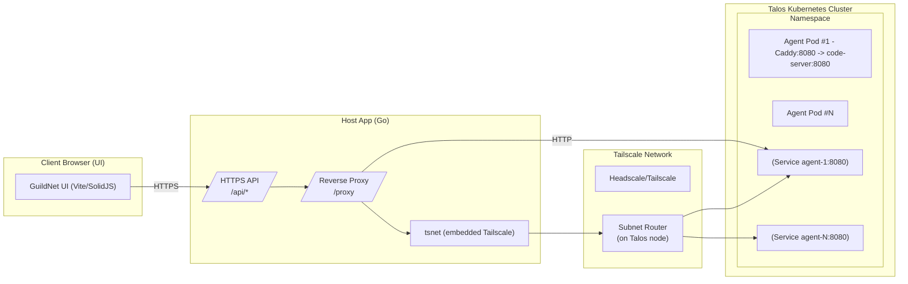
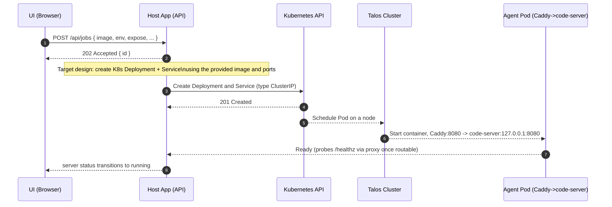
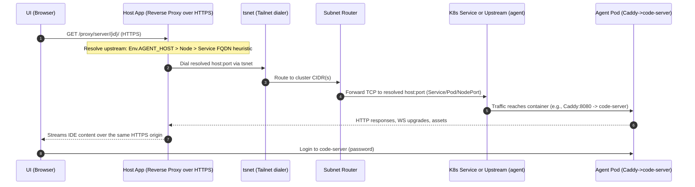

## GuildNet architecture

This document explains the end-to-end flow for launching agent containers in a Talos Kubernetes cluster and securely accessing each agent’s code-server UI in the browser via an iframe, with the Host App acting as a reverse-proxy over the Tailscale network (tsnet).

Goals
- Launch multiple agent containers dynamically in the Talos cluster (one per “workload”).
- Reach each agent over the tailnet without exposing it publicly.
- The Host App is the single HTTPS origin for the browser, brokering traffic to agents via tsnet.
- The UI embeds code-server from the agent in an iframe through the Host App’s reverse-proxy.

## Components

- Client UI (Vite + SolidJS)
  - Launch form to create a workload (image/env/ports/etc.)
  - Servers list/detail with an “IDE” tab that loads code-server in an iframe
  - Calls the Host App at VITE_API_BASE (HTTPS)

- Host App (Go)
  - HTTPS server for API and reverse proxy (runs locally or on a reachable host)
  - Embeds Tailscale using tsnet for network transport to private destinations
  - Endpoints:
    - /api/jobs: accepts a “launch agent” request (future: creates K8s Deployment + Service)
    - /api/servers, /api/servers/:id, /api/servers/:id/logs, /sse/logs
    - /proxy and /proxy/{to}/…: reverse proxy to agent addresses via tsnet
    - /proxy/server/{id}/…: server-aware proxy that resolves the correct upstream automatically
  - Allowlist (CIDR, host:port) governs which upstreams /proxy can reach

- Tailscale control plane (Headscale or Tailscale)
  - Authenticates nodes (Host App and cluster nodes)
  - Distributes routes and DNS/MagicDNS for the tailnet

- Talos Kubernetes cluster (inside the tailnet)
  - One or more nodes running a Tailscale client
  - A Tailscale Subnet Router advertising cluster CIDRs (recommended), so tsnet can dial Pod/Service IPs
  - Kubernetes API (Host App will talk to it to deploy agents; design target)

- Agent container image (images/agent)
  - Runs code-server bound to 127.0.0.1:8080
  - Caddy listens on $PORT (default 8080) and reverse-proxies to code-server
  - Iframe-friendly headers (removes X-Frame-Options; sets CSP frame-ancestors 'self' *)
  - /healthz endpoint for probes
  - Password set via PASSWORD or generated and stored in /data/.code-server-password

## High-level view

Notes
- Browser only talks to the Host App over HTTPS.
- Host App proxies to agents using tsnet, which rides the tailnet to reach cluster IPs via a Subnet Router.
- Between the Host App and the agent, the hop is HTTP (Caddy -> code-server), but the browser-facing hop remains HTTPS.

Environment assumptions
- Talos Kubernetes cluster is required (e.g., running as a VM on the host). There is no “local mode.”
- The backend owns workload metadata by reading from Kubernetes (Deployments/Services/Pods). The UI does not persist server state.

## Launch flow (UI → Host App → Kubernetes → Agent)

Intent: Use the Launch UI to deploy a new agent container (code-server+Caddy) in the cluster and make it accessible via the Host App.

Important choices
- Upstream resolution model (generic, any image)
  - Primary hint: server Env.AGENT_HOST (may include optional :port)
  - Secondary hints: server.Node (tailscale/DNS-resolvable host) or derived Service FQDN from server.Name and a configured namespace/suffix
  - Port/scheme inference: prefer 8443 if exposed, otherwise 8080; scheme https for 8443, http otherwise
  - The UI uses /proxy/server/{id}/… so the backend decides the best upstream automatically
- Expose ports: For the code-server agent, HTTP 8080 is sufficient (Caddy → code-server). Other images can declare ports in server metadata.

## Access flow (iframe via reverse-proxy over tsnet)

Intent: The UI Server Detail page embeds code-server in an iframe. The iframe src points to the Host App’s /proxy endpoint, which dials the agent over the tailnet and streams the IDE to the browser.

Why this works in a browser
- The iframe src is the Host App origin (HTTPS), so there’s no mixed-content issue.
- Caddy in the agent sets CSP headers to allow embedding; X-Frame-Options is removed.
- WebSockets used by code-server are proxied transparently by the Host App.

## Addressing model and allowlist

- Addressing and resolution
  - The UI uses /proxy/server/{id}/… so the backend can resolve the upstream generically for any workload
  - Backend resolution order:
    1. Env.AGENT_HOST (honors optional :port)
    2. server.Node (if resolvable/reachable) with inferred port
    3. Service FQDN heuristic from server.Name: <dns1123(name)>.<namespace>.<suffix> with inferred port
  - If all hints fail, backend responds with guidance to set Env.AGENT_HOST or provide ports/node in server metadata
  - Advanced: still supports /proxy?to=host:port&path=/… when you want explicit targets

- Allowlist
  - The Host App enforces an allowlist for /proxy requests: CIDRs and/or host:port entries in ~/.guildnet/config.json
  - For development, a permissive default may be applied; for production, restrict to cluster CIDRs or specific service endpoints

## Kubernetes responsibilities (target design)

When the UI posts /api/jobs:
- The Host App uses Kubernetes credentials to create:
  - A Deployment for the agent image (guildnet/agent) with:
    - env: PASSWORD (optional), AGENT_HOST (optional hint), PORT=8080
    - probes: GET /healthz
    - volumes: /data and /workspace (PVCs recommended in prod)
  - A Service (ClusterIP) exposing port 8080 (and optionally 8443)
- The Host App registers a “server” record and can later resolve an upstream from its metadata without requiring the UI to supply AGENT_HOST.
- Logs/events are streamed back to the UI (SSE) as the Deployment progresses.

Today’s state in repo
- /api/jobs currently accepts and seeds an in-memory server record (no real K8s call yet), for local/demo flows.
- The networking, proxying, and iframe integration are implemented; wiring to Kubernetes is the next step.

## Security and TLS

- Browser ↔ Host App: HTTPS with server certs (repo/dev certs or self-signed fallback)
- Host App ↔ Agent: HTTP by default (Caddy→code-server). You can run the agent’s 8443, but it’s not required when terminating TLS at the Host App.
- Authentication to the tailnet: Host App uses tsnet with an auth key and a login server (Headscale/Tailscale).
- code-server: requires a password. Provide it via env or mount /data to persist the generated password.
- Allowlist: lock down /proxy targets to the cluster ranges/services you intend to reach.
- CORS: Host App allows a specific frontend origin for API calls.

## Failure modes and troubleshooting

- IDE iframe doesn’t load
  - Check that /proxy to the agent Service is allowlisted and reachable
  - Verify tailscale/tsnet connectivity and that a Subnet Router advertises cluster CIDRs
  - Confirm AGENT_HOST resolves from the Host App’s perspective (or switch to a literal ClusterIP)
  - Ensure the agent is Ready; /healthz should return ok

- Mixed content or blocked by X-Frame-Options
  - The iframe src must be the Host App’s HTTPS origin, not the agent directly
  - The agent’s Caddy removes X-Frame-Options and sets CSP for frame-ancestors

- WebSockets fail
  - Verify the Host App proxy path uses scheme=http to the agent (code-server over HTTP), and that /proxy handles upgrades

- DNS resolution of Service names
  - If the Host App can’t resolve *.svc.cluster.local, it can still proxy via server.Node + NodePort or direct Pod IP
  - For reliable resolution, use a Tailscale subnet router advertising cluster CIDRs, or set Env.AGENT_HOST to an IP

## Port and protocol summary

- Host App: HTTPS on local address (e.g., 127.0.0.1:8080) and a tsnet listener on :443 inside the tailnet
- Agent: HTTP on 8080 (Caddy), reverse-proxying to code-server 127.0.0.1:8080
- Tailnet: control plane (Headscale/Tailscale) and Subnet Router(s) advertising cluster CIDRs

## What “multiple agents” means here

- Each agent is an independent Deployment+Service pair in Kubernetes (or one Deployment with multiple replicas and per-tenant routing)
- The UI lists all “servers” and their statuses
- The IDE tab for a selected server points the iframe to /proxy targeting that server’s AGENT_HOST:8080
- The Host App’s /proxy simply needs the to=host:port; tsnet handles reachability over the tailnet

## Appendix: minimal example values

- Subnet Router advertises: 10.244.0.0/16 (Pod CIDR), 10.96.0.0/12 (Service CIDR)
- Service name: agent-demo (DNS: agent-demo.default.svc.cluster.local)
- AGENT_HOST: agent-demo.default.svc.cluster.local or the Service’s ClusterIP (e.g., 10.96.x.y)
- UI iframe src: https://<hostapp>/proxy/server/{id}/
