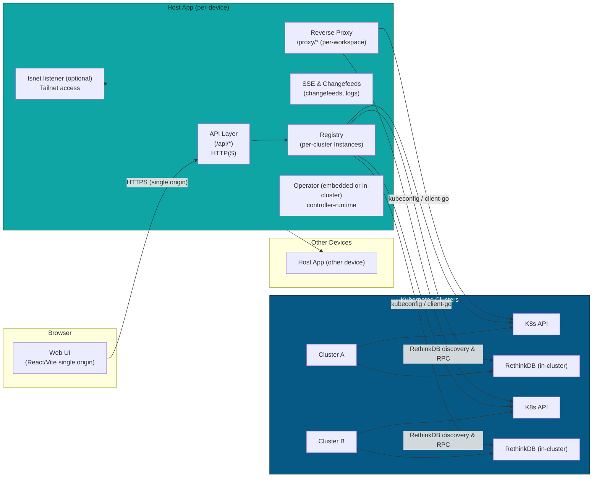

GuildNet Architecture (complete, code-driven)

This file now reflects the current codebase behavior and the features implemented across the Host App, embedded operator, proxying, and database management. The Host App is intended to run on every device in a fleet; each instance acts as a local portal and can join and manage multiple Kubernetes clusters by persisting per-cluster kubeconfigs and running per-cluster clients.

### Component Overview (distributed)

High level summary (from the codebase)

- Each Host App instance can manage multiple clusters by storing per-cluster kubeconfigs under local state (the DB key `credentials: cl:{id}:kubeconfig`).
- `POST /bootstrap` accepts a join payload (guildnet.config or a JSON body with kubeconfig) and persists a cluster record and the raw kubeconfig into local state, then attempts a bounded pre-warm check (10s) to create a Registry Instance and connect to Kubernetes and the cluster's RethinkDB. If pre-warm fails, bootstrap cleans up persisted state and replies with an error (see `internal/api/router.go`).
- The Registry builds and caches per-cluster `Instance` objects. Each Instance contains a per-cluster SQLite (`internal/localdb`), a `k8s.Client` (`internal/k8s`), a cached dynamic client `Instance.Dyn` for CRDs, a port-forward manager, and a lazily-initialized RethinkDB manager created by `Instance.EnsureRDB` (see `internal/db/cluster.go`).

### Dynamic Workspaces & code-server behavior (how servers are spun up)

- Users create Workspaces via the API (`POST /api/jobs` or the UI), which become `Workspace` CRs in the target cluster (the Host App writes the CR via the per-cluster client from the Registry).
- The Workspace controller (`internal/operator/workspace_controller.go`) reconciles each `Workspace` into a Deployment and a Service. Key implementation details:
  - Ports are built from `Workspace.spec.ports`; if none are provided the reconciler defaults to port 8080.
  - The controller ensures `PORT=8080` in the container environment; for code-server images it also ensures a `PASSWORD` environment variable (default `changeme` when not supplied).
  - When the image looks like code-server (detects substrings `code-server` or `codercom/code-server`) it injects explicit args so code-server binds on `0.0.0.0:8080` with `--auth password`. The deployment also relaxes some security flags so code-server's helper tools (e.g., fixuid) can run.
  - Default probes target `/` on the chosen port with generous initial delays/timeouts to accommodate slow startups.
  - Services are created with `publishNotReadyAddresses=true` so upstream proxying can route while pods are warming up; the controller sets Service type to `LoadBalancer` when `Workspace.Spec.Exposure` requests it.

This means the system can dynamically spin up containers running images such as coder's code-server, expose them via a Service or LoadBalancer, and make them accessible to the UI via the Host App reverse proxy.

### Reverse proxying and websockets (how the UI connects to code-server)

- The Host App reverse proxy (`internal/proxy/reverse_proxy.go`) supports multiple resolution modes:
  1. Resolve to a Service IP/port (ClusterIP / LoadBalancer).</n+ 2. If an `AGENT_HOST` or similar hint is provided, prefer direct host:port dialing.
 3. If the target is a Kubernetes in-cluster address, and an API proxy transport is available, use the API proxy transport.
 4. Fallback to opening a managed SPDY port-forward and routing to `127.0.0.1:<pf>`.
- The proxy builds two transports and a `dualTransport` that chooses the API proxy transport for API paths and the standard transport for normal traffic. Dialing uses the Registry's per-Instance dialer when necessary.
- WebSocket upgrades are supported; tests in `tests/ws_proxy_test.go` verify that WebSocket connections can be proxied end-to-end.
- The proxy rewrites headers to allow code-server to work inside an iframe and a subpath: 
  - It sets `X-Forwarded-Prefix` so upstream apps can generate correct links.
  - It rewrites `Location` headers and `Set-Cookie` attributes (dropping Domain, setting Secure, SameSite=None, Partitioned and normalizing Path) so session cookies work from the Host App origin.

Result: the user UI (an iframe) can open HTTP and WebSocket connections to a code-server instance running inside the cluster and interact with it (file editing, terminals, etc.).

### Database (RethinkDB) operations and UI features

- RethinkDB discovery and connect logic lives in `internal/db/cluster.go`. The algorithm:
  - If an explicit address override is provided, use it.
  - Otherwise query the Service named by `RETHINKDB_SERVICE_NAME`/`RETHINKDB_NAMESPACE` and try, in order: LoadBalancer Ingress IP/Hostname, NodePort (resolve node IPs), ClusterIP.
  - If an address is found the code connects using rethinkdb-go with short timeouts and limited connection pool.
- The Host App exposes a full DB management HTTP API under `/api/cluster/{id}/db` used by the UI components under `ui/src/`:
  - List databases: GET `/api/cluster/{id}/db`
  - Create database: POST `/api/cluster/{id}/db` (body: id, name, description)
  - Drop database: DELETE `/api/cluster/{id}/db/{dbId}`
  - List tables: GET `/api/cluster/{id}/db/{dbId}/tables`
  - Create table: POST `/api/cluster/{id}/db/{dbId}/tables`
  - Delete table: DELETE `/api/cluster/{id}/db/{dbId}/tables/{table}`
  - Row operations: GET/POST/PUT/DELETE on `/api/cluster/{id}/db/{dbId}/tables/{table}/rows` and `/rows/{rowId}` for listing, inserting, updating and deleting.
  - Import/Export: endpoints for importing and exporting tables (used by UI `TableImportExport`).
  - Permissions and audit endpoints: UI routes reference `/permissions` and `/audit` endpoints for per-table management and audit logs.
  - SSE changefeeds: streaming endpoints under `/sse/cluster/{id}/db/{dbId}/tables/{table}/changes` allow the UI to subscribe to changefeeds.

These endpoints are implemented to use the per-Instance `RDB` manager when available. The router avoids triggering long `EnsureRDB` reconnect attempts during normal request handling by checking `Registry.RDBPresent(clusterID)` first.

### Join/bootstrap flow and cluster management

- The join generator `scripts/create_join_info.sh` produces a `guildnet.config` containing a kubeconfig and optional hints (hostname, login server, include-ca, etc.).
- The Host App `POST /bootstrap` handler (`internal/api/router.go`) accepts either the full join file or a JSON payload with a `cluster.kubeconfig` field. When kubeconfig is present the handler:
  - Generates a cluster id and persists a minimal cluster record in local DB (`clusters` table) and writes the kubeconfig to `credentials: cl:{id}:kubeconfig`.
  - If a `Registry` is configured, it calls `Registry.Get(ctx, id)` and performs a bounded (10s) connectivity check against the Kubernetes API (list namespaces limit=1) and calls `inst.EnsureRDB` with a short timeout to pre-warm the cluster DB.
  - On any failure during pre-warm the bootstrap handler deletes the persisted cluster record and kubeconfig and returns an HTTP error (422) describing the failure. This ensures bootstrap is atomic and UI-friendly.

This design allows any hostapp instance to be given a `guildnet.config` and join/manage the same cluster independently.

### Operator modes and CRDs

- CRDs for `Workspace` and `Capabilities` live in `config/crd/` and are applied by `scripts/deploy-operator.sh` or as part of a full deploy.
- The operator can run embedded inside the Host App (dev flow: `scripts/run-hostapp.sh` starts the Host App with an embedded operator) or as a Deployment (`scripts/deploy-operator.sh` creates RBAC and a Deployment in `guildnet-system`).
- The reconciler uses `controllerutil.CreateOrUpdate` semantics and updates Workspace Status with `ServiceDNS`, `ServiceIP`, `ReadyReplicas`, `Phase`, and `ProxyTarget` (e.g., `http://svc.namespace.svc:8080`).

### API Surface (exhaustive, code-backed)

- Health and status
  - GET `/healthz` — process liveness and quick checks.

- Join/bootstrap
  - POST `/bootstrap` — accept join file or JSON with kubeconfig and cluster hints (pre-warm clients).

- Jobs / Workspaces
  - POST `/api/jobs` — create a job/workspace request (translates to a `Workspace` CR).
  - GET `/api/jobs` and `/api/jobs/{id}` — job listing and status.

- Per-cluster operations
  - GET/PUT `/api/settings/cluster/{id}` — per-cluster settings (namespace, ingress hints, image pull secret, exposure options).
  - GET `/api/cluster/{id}/servers` — list servers/workspaces (UI uses this heavily).
  - Proxy: `/api/cluster/{id}/proxy/server/{name}/...` — proxy into workspace server endpoints; the code sets `X-Forwarded-Prefix` to ensure upstream apps generate correct links.

- Database API (per cluster)
  - GET `/api/cluster/{id}/db` — list databases
  - POST `/api/cluster/{id}/db` — create DB
  - GET `/api/cluster/{id}/db/{dbId}/tables` — list tables
  - POST `/api/cluster/{id}/db/{dbId}/tables` — create table
  - GET/POST/PUT/DELETE `/api/cluster/{id}/db/{dbId}/tables/{table}/rows` — row operations
  - Import/Export endpoints, `/permissions` and `/audit` endpoints referenced by UI components
  - SSE: `/sse/cluster/{id}/db/{dbId}/tables/{table}/changes`

- Proxy and SSE
  - `/proxy` (path or query form) — general purpose reverse proxy (server-aware form `/proxy/server/{id}/...` is used by the UI)
  - `/sse/...` — server-sent events for logs and changefeeds

### Wiring, lifecycle and implementation notes

- Registry lifecycle: `Registry.Get(ctx, id)` creates `Instance` and caches clients; `Registry.RDBPresent(clusterID)` is used by handlers to avoid expensive syncs in requests. `Instance.EnsureRDB` is the only call that establishes RethinkDB connections and is used in bootstrap and background monitors.
- Port-forwards are de-duplicated per `Instance` and only used as a fallback for proxying UI/IDE traffic; they're not used as the primary mechanism for DB traffic.
- The dynamic client for CRD operations is created once per Instance and reused for workspace CR operations.

### Observability and metrics

- Structured logs include request IDs and component prefixes. The operator and Host App log major lifecycle events (bootstrap, instance create/close, RDB connect). The Host App exposes `/healthz` and per-cluster health endpoints for RDB and local DB.
- Per-cluster metrics keys are used so metrics can be scraped/filtered by cluster; the repo includes basic metrics hooks.

### Security and headers

- HTTPS: the Host App serves HTTPS locally (`LISTEN_LOCAL`) and supports tailnet TLS for remote access; certs are read from `./certs/` or generated under `~/.guildnet/state/certs/`.
- The reverse proxy normalizes cookies and rewrites Location to keep embedded IDEs working in iframes with a single origin.
- No built-in user auth in the Host App; the recommended deployment is behind tailnet or an external auth proxy and rely on Kubernetes RBAC for cluster operations.

### Developer & deployment workflow (concrete)

- `scripts/kind-setup.sh` — create a local kind cluster and write kubeconfig to `~/.guildnet/kubeconfig`.
- `scripts/deploy-metallb.sh` — install MetalLB and auto-select an IP pool for kind; used by dev to give LoadBalancer services an external IP.
- `k8s/rethinkdb.yaml` — StatefulSet + PVC template + LoadBalancer Service annotated for MetalLB (the cluster deploy uses this in dev).
- `scripts/deploy-operator.sh` — create `guildnet-system` namespace, RBAC, and an in-cluster operator Deployment (image is configurable via env/IMAGE).
- `scripts/run-hostapp.sh` — run the Host App binary locally with `KUBECONFIG=~/.guildnet/kubeconfig` and embedded operator enabled; this is the recommended dev flow.

### Operational notes & limitations

- Per-device state: all persisted per-cluster kubeconfigs, localdb files and certs are under `~/.guildnet/state/` on each hostapp instance.
- Pre-warm behavior: bootstrap performs short (10s) attempts to create clients and connect to RethinkDB; failures roll back persisted cluster state to avoid stale configs in UI.
- Production notes: pick a durable `StorageClass` for RethinkDB PVCs, and consider running the operator in-cluster for middle/large clusters.
- Limitations: no native user auth, hostapp-per-device resource usage requires orchestration for fleet upgrades, and some dev conveniences (MetalLB) are intended for local/dev only.

If you'd like, I can now:

- Add a short `README` snippet that documents the exact `POST /bootstrap` shape (JSON and form upload) and the expected `guildnet.config` format.
- Add a `Makefile` target (e.g., `make recreate-dev`) that runs the exact dev steps we used: `scripts/kind-setup.sh`, `scripts/deploy-metallb.sh`, and `kubectl apply -f k8s/rethinkdb.yaml`.
- Patch `scripts/deploy-operator.sh` to support an automated `kind load docker-image` step or accept a `LOCAL_IMAGE` flag so building+loading a local operator image into kind is straightforward.

Tell me which of the follow-ups you want and I'll implement it next.
